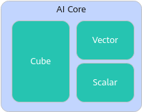

# AI Core/Cube Core/Vector Core简介

**了解AI Core、Cube Core、Vector Core的关系**：

为便于理解AI Core、Cube Core、Vector Core的关系，此处先明确Core的定义，Core是指拥有独立Scalar计算单元的一个计算核，通常Scalar计算单元承担了一个计算核的SIMD（单指令多数据，Single Instruction Multiple Data）指令发射等功能，所以我们通常把这个Scalar计算单元称为核内的调度单元。不同产品上的AI数据处理核心单元不同，当前分为以下几类：

-   当AI数据处理核心单元是AI Core：
    -   在AI Core内，Cube和Vector共用一个Scalar调度单元，例如<term>Atlas 训练系列产品</term>。

        

    -   在AI Core内，Cube和Vector都有各自的Scalar调度单元，因此又被称为Cube Core、Vector Core。这时，一个Cube Core和一组Vector Core被定义为一个AI Core，AI Core数量通常是以多少个Cube Core为基准计算的，例如<term>Atlas A2 训练系列产品/Atlas A2 推理系列产品</term>。

        

-   当AI数据处理核心单元是AI Core以及单独的Vector Core：AI Core和Vector Core都拥有独立的Scalar调度单元，例如<term>Atlas 推理系列产品</term>。

    

