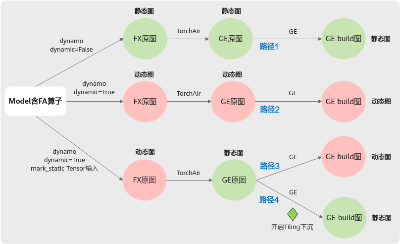

# 模型中存在FA算子，如何执行整图静态下沉调度

FA（Flash Attention）算子作为一个Tiling值依赖的算子，包含该类算子的模型如何实现整图静态下沉，可以从以下方面分析：

1.  首先分析FA算子参数特点。
2.  其次分析整图转换为静态图下沉调度的条件。
3.  最后提供未采用下沉调度的定位思路。

## FA算子原型

从算子原型可以看出，该算子不仅有Tensor输入（如query、key、value等），还有SymInt\[\]输入（如actual\_seq\_lengths）。

-   算子原型1

    ```
    - func: npu_incre_flash_attention(Tensor query, Tensor key, Tensor value, *, Tensor? padding_mask=None, Tensor? atten_mask=None, Tensor? pse_shift=None, SymInt[]? actual_seq_lengths=None, Tensor? antiquant_scale=None, Tensor? antiquant_offset=None, Tensor? block_table=None, Tensor? dequant_scale1=None, Tensor? quant_scale1=None, Tensor? dequant_scale2=None, Tensor? quant_scale2=None, Tensor? quant_offset2=None, Tensor? kv_padding_size=None, int num_heads=1, float scale_value=1.0, str input_layout="BSH", int num_key_value_heads=0, int block_size=0, int inner_precise=1) -> Tensor
    ```

-   算子原型2

    ```
    - func: npu_fused_infer_attention_score(Tensor query, Tensor key, Tensor value, *, Tensor? pse_shift=None, Tensor? atten_mask=None, SymInt[]? actual_seq_lengths=None, SymInt[]? actual_seq_lengths_kv=None, Tensor? dequant_scale1=None, Tensor? quant_scale1=None, Tensor? dequant_scale2=None, Tensor? quant_scale2=None, Tensor? quant_offset2=None, Tensor? antiquant_scale=None, Tensor? antiquant_offset=None, Tensor? key_antiquant_scale=None, Tensor? key_antiquant_offset=None, Tensor? value_antiquant_scale=None, Tensor? value_antiquant_offset=None, Tensor? block_table=None, Tensor? query_padding_size=None, Tensor? kv_padding_size=None, Tensor? key_shared_prefix=None, Tensor? value_shared_prefix=None, SymInt[]? actual_shared_prefix_len=None, Tensor? query_rope=None, Tensor? key_rope=None, Tensor? key_rope_antiquant_scale=None, int num_heads=1, float scale=1.0, int pre_tokens=2147483647, int next_tokens=2147483647, str input_layout="BSH", int num_key_value_heads=0, int sparse_mode=0, int inner_precise=0, int block_size=0, int antiquant_mode=0, int key_antiquant_mode=0, int value_antiquant_mode=0, bool softmax_lse_flag=False) -> (Tensor, Tensor)
    ```

## 下沉条件

根据模型脚本中Dynamo（如dynamic、mark\_static等）及GE配置（如Tiling下沉等），包含FA算子的模型有如下编译路径：



-   路径1，dynamic=False（是否开启Tiling下沉对编译结果无影响）。

    所有Tensor输入的shape具体维度值被编译为固定常量，FX图中的SymInt\[\]输入被编译为常量，因此FX图为静态图。FX图中的Tensor输入转换成shape为固定常量的ge.Data节点，FX图中的常量输入转换成GE图中ge.Const节点，因此GE原图为静态图。FA的actual\_seq\_lengths输入在GE图上是ge.Const节点，即值依赖的输入是ge.Const节点，因此每次执行之前不需要重新计算Tiling，这种情况下GE将FA划分到静态部分，因此GE build图为静态图。

-   路径2，dynamic=True（是否开启Tiling下沉对编译结果无影响）。

    所有Tensor输入的shape具体维度值被编译为符号，FX图中的SymInt\[\]输入被编译为符号，因此FX图为动态图。FX图中的Tensor输入转换成shape为ge.Data节点，shape中的符号维度用-1标识，FX图中的符号输入转换成shape固定的ge.Data节点，因此GE原图为动态图。由于ge.Data节点的shape包含-1，因此GE build图为动态图。

-   路径3，dynamic=True，mark\_static tensor输入，不开启Tiling下沉。

    所有Tensor输入的shape具体维度值被编译为固定常量，FX图中的SymInt\[\]输入被编译为符号，因此FX图为动态图。FX图中的Tensor输入转换成shape为固定常量的ge.Data节点，FX图中的符号输入转换成shape固定的ge.Data节点，因此GE原图为静态图。由于未开启Tiling下沉，FA采用Host调度，因此GE build图为动态图。

-   路径4，dynamic=True，mark\_static tensor输入，开启Tiling下沉。

    所有Tensor输入的shape具体维度值被编译为固定常量，FX图中SymInt\[\]输入被编译为符号，因此FX图为动态图。FX图中的Tensor输入转换成shape为固定常量的ge.Data节点，FX图中的符号输入转换成shape固定的ge.Data节点，因此GE原图为静态图。由于开启了GE Tiling下沉，FA采用静态下沉，因此GE build图为静态图。

路径1和路径4都能实现编译后的GE图为静态图。路径1中，SymInt\[\]被编译为常量，如果模型运行时SymInt\[\]的值发生变更，则会触发重新编译。路径4中，SymInt\[\]编译时被泛化为符号，如果模型运行时SymInt\[\]的值发生变更，不会触发重新编译，仍然使用首次编译的结果。因此，为了实现包含FA算子的整图静态下沉，只能选择路径4。

**路径4的关键条件如下**：

1.  torch.compile的dynamic设置为True

    ```python
    # dynamic设置为True示例
    model = Network().npu()
    model = torch.compile(model, fullgraph=True, backend=npu_backend, dynamic=True)
    ```

2.  输入Tensor进行mark\_static

    ```python
    # mark_static示例
    inp = torch.randn(100, 128).npu()
    torch._dynamo.mark_static(inp)
    ```

3.  开启Tiling下沉

    ```python
    # 开启Tiling下沉示例
    config = CompilerConfig()
    config.experimental_config.tiling_schedule_optimize = True
    npu_backend = torchair.get_npu_backend(compiler_config=config) 
    ```

## 定位思路

当发现包含FA算子的模型编译为GE动态图而非期望的GE静态图时，可按照以下流程进行排查和定位。


1.  检查模型脚本。

    确保torch.compile的dynamic入参为True，Tensor输入已mark\_static，已开启Tiling下沉。

2.  检查TorchAir dump图或GE dump图中Tensor输入shape的维度。

    如果输入shape的具体维度值为-1，说明对应的输入Tensor未mark\_static，找到对应的输入Tensor进行mark\_static。

3.  经过步骤1和步骤2后，预期编译后的GE build图为静态图。
4.  若仍未能解决问题，可单击[Link](https://www.hiascend.com/support)联系技术支持协助定位排查。
