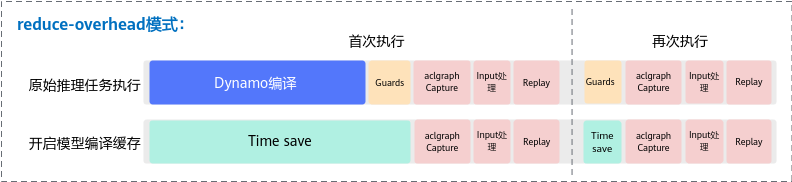

# 模型编译缓存功能（aclgraph）

## 功能简介

>**须知：** reduce-overhead模式下的功能为试验特性，后续版本可能存在变更，暂不支持应用于商用产品中。

torch.compile是一种即时编译器（Just-In-Time compiler），成图首次编译时间通常较长，而大模型推理场景对时延敏感，因此优化首次编译时长显得尤为重要。在推理服务和弹性扩容等业务场景中，使用编译缓存可有效缩短服务启动后的首次推理时延。

成图编译涉及两段耗时，一段是Dynamo的编译耗时，另一段是基于Dynamo编译出的FX图进行再处理的耗时，再处理的行为会根据模式不同而有所变化。

为降低成图编译的耗时，TorchAir提供了模型编译缓存方案，通过[cache\_compile](cache_compile.md)接口将首次编译的结果保存，从而加快torch.compile图模式的启动时间。

**图 1**  reduce-overhead执行时间分布示意图  


以LLaMA 2-70B（Large Language Model Meta AI 2）为例，上图呈现了启动与未开启模型编译缓存的耗时分布。需要注意的是，该图不呈现与本功能无关的耗时细节。

-   原始推理任务执行，分为5个阶段：
    1.  Dynamo：一个Python级Just-In-Time（JIT）编译器，其重写Python字节码，以将PyTorch操作序列提取到[FX图](https://pytorch.org/docs/stable/fx.html)中，然后使用可定制的后端进行编译。
    2.  Guards：Dynamo编译生成[Guards](https://pytorch.org/docs/2.6/torch.compiler_troubleshooting.html#guards)，并在每次执行前执行Guards，用于区分程序是否需要被重新捕获与编译。
    3.  aclgraph Capture：reduce-overhead模式下捕获Stream任务到Device侧。
    4.  Input处理：更新图内input类参数输入地址为图实际运行时的输入地址。
    5.  Replay：Device基于给定的输入进行真正的计算并得到输出结果。

-   开启模型编译缓存：

    通过缓存Dynamo这个耗时占比最大环节，实现模型的加速启动。

## 使用约束

-   本功能支持如下产品：
    -   <term>Atlas A3 训练系列产品/Atlas A3 推理系列产品</term>
    -   <term>Atlas A2 训练系列产品/Atlas A2 推理系列产品</term>
-   本功能仅支持reduce-overhead模式。
-   如果图中包含依赖随机数生成器（RNG）的算子（例如randn、bernoulli、dropout等），不支持使用本功能。
-   reduce-overhead模式下，本功能跳过了Dynamo的JIT编译环节、Guards环节，与torch.compile原始方案相比多了如下限制：
    -   缓存要与执行计算图一一对应，若重编译则缓存失效。
    -   Guards阶段被跳过且不会触发JIT编译，要求生成模型的脚本和加载缓存的脚本一致。
    -   CANN包跨版本缓存无法保证兼容性，如果版本升级，需要清理缓存目录并重新进行Ascend IR计算图编译生成缓存。

## Dynamo编译缓存

本节提供一个简化版的模型编译缓存使用示例，同时展示缓存对特殊类型输入的处理能力（如Python Class类型、List类型等）。

1.  准备PyTorch模型脚本。

    假设在/home/workspace目录下定义了test.py模型脚本，代码示例如下：

    ```python
    import torch
    import dataclasses
    from typing import List
    import torch_npu
    import torchair
    from torchair.configs.compiler_config import CompilerConfig
    
    config = CompilerConfig()
    # 需配置reduce-overhead模式
    config.mode = "reduce-overhead"
    npu_backend = torchair.get_npu_backend(compiler_config=config)
    
    # InputMeta为仿照VLLM(Versatile Large Language Model)框架的入参结构
    @dataclasses.dataclass
    class InputMeta:
        data: torch.Tensor
        is_prompt: bool
    
    class Model(torch.nn.Module):
        def __init__(self):
            super().__init__()
            self.linear1 = torch.nn.Linear(2, 1)
            self.linear2 = torch.nn.Linear(2, 1)
            for param in self.parameters():
                torch.nn.init.ones_(param)
    
        @torch.inference_mode()
        def forward(self, x: InputMeta, kv: List[torch.Tensor]):
            return self.linear2(x.data) + self.linear2(kv[0])
    
    x = InputMeta(data=torch.randn(2, 2).npu(), is_prompt=True)
    kv = [torch.randn(2, 2).npu()]
    model = Model().npu()
    # 调用torch.compile编译
    compiled_model = torch.compile(model, backend=npu_backend)
    # 执行prompt
    res_prompt = compiled_model(x, kv)
    x.is_prompt = False
    # 执行decode
    res_decode = compiled_model(x, kv)
    ```

2.  改造PyTorch模型脚本。
    1.  先处理forward函数。

        将test.py中“forward”函数的实现提取为“**\_forward**”函数，避免@torch.inference\_mode的影响，结果如下。

        ```python
        @torch.inference_mode()
        def forward(self, x: InputMeta, kv: List[torch.Tensor]):
            return self._forward(x, kv)
        def _forward(self, x, kv):
            return self.linear2(x.data) + self.linear2(kv[0])
        ```

    2.  通过[cache\_compile](cache_compile.md)接口实现编译缓存。

        “**\_forward**”函数是可以缓存编译的函数，但由于其会触发多次重新编译，所以要为每个场景封装一个新的func函数，然后func直接调用\_forward函数。同时，forward函数中添加调用新函数的判断逻辑。如何封装新的func函数，取决于原始模型逻辑，请用户根据实际场景自行定义。

        > **说明：** 
        >-   func函数只能被触发一次Dynamo trace，换言之如果func发生重编译，则会放弃缓存。
        >-   对于发生多次trace（Guards失效）的函数，需要进行一次函数封装来使缓存生效。
        >-   func必须是method，即module实例对象的方法，且该方法未被其他装饰器修饰。
        >-   func必须能形成整图，即必须支持full graph。
        >-   使用cache\_compile接口后，原先脚本中的**torch.compile编译流程不再需要**。

        test.py中只展示了prompt和decode的func函数封装，具体代码示例如下：

        ```python
        import dataclasses
        import logging
        from typing import List
        
        import torch
        import torch_npu
        import torchair
        from torchair import logger
        from torchair.configs.compiler_config import CompilerConfig
        
        config = CompilerConfig()
        
        logger.setLevel(logging.INFO)
        
        
        # InputMeta为仿照VLLM(Versatile Large Language Model)框架的入参结构
        @dataclasses.dataclass
        class InputMeta:
            data: torch.Tensor
            is_prompt: bool
        
        
        class Model(torch.nn.Module):
            def __init__(self):
                super().__init__()
                self.linear1 = torch.nn.Linear(2, 1)
                self.linear2 = torch.nn.Linear(2, 1)
                for param in self.parameters():
                    torch.nn.init.ones_(param)
        
                # 通过torchair.inference.cache_compile实现编译缓存
                self.cached_prompt = torchair.inference.cache_compile(self.prompt, config=config)
                self.cached_decode = torchair.inference.cache_compile(self.decode, config=config)
        
            def forward(self, x: InputMeta, kv: List[torch.Tensor]):
                # 添加调用新函数的判断逻辑
                if x.is_prompt:
                    return self.cached_prompt(x, kv)
                return self.cached_decode(x, kv)
        
            def _forward(self, x, kv):
                return self.linear2(x.data) + self.linear2(kv[0])
        
            # 重新封装为prompt函数
            def prompt(self, x, y):
                return self._forward(x, y)
        
            # 重新封装为decode函数
            def decode(self, x, y):
                return self._forward(x, y)
        
        x = InputMeta(data=torch.randn(2, 2).npu(), is_prompt=True)
        kv = [torch.randn(2, 2).npu()]
        model = Model().npu()
        # 注意无需调用torch.compile进行编译，直接执行model 
        # 执行prompt
        res_prompt = model(x, kv)
        x.is_prompt = False
        # 执行decode
        res_decode = model(x, kv)
        ```

3.  模型脚本改造后，运行并生成封装func函数的缓存文件。
    1.  进入test.py所在目录，执行如下命令：

        ```bash
        cd /home/workspace
        python3 test.py
        ```

    2.  参考[TorchAir Python层日志](TorchAir-Python层日志.md)开启INFO日志，首次执行可以看到如下打印日志：

        ```text
        [INFO] TORCHAIR 2024-04-30 14:48:18 Cache ModelCacheMeta(name='CacheCompileSt.test_cache_hint.<locals>.Model.prompt(x, y)', date='2024-04-30 14:48:16.736731', version='1.0.0', fx=None) saved to /home/workspace/.torchair_cache/Model_dynamic_f2df0818d06118d4a83a6cacf8dc6d28/prompt/compiled_module
        [INFO] TORCHAIR 2024-04-30 14:48:20 Cache ModelCacheMeta(name='CacheCompileSt.test_cache_hint.<locals>.Model.decode(x, y)', date='2024-04-30 14:48:19.654573', version='1.0.0', fx=None) saved to /home/workspace/.torchair_cache/Model_dynamic_f2df0818d06118d4a83a6cacf8dc6d28/decode/compiled_module
        ```

        生成的各个func函数缓存文件路径由[cache\_compile](cache_compile.md)中cache\_dir参数指定，支持相对路径和绝对路径。

        -   若cache\_dir指定路径，且为绝对路径，则缓存文件路径为$\{cache\_dir\}/$\{model\_info\}/$\{func\}。
        -   若cache\_dir指定路径，且为相对路径，则缓存文件路径为$\{work\_dir\}/$\{cache\_dir\}/$\{model\_info\}/$\{func\}。

        $\{cache\_dir\}默认为“.torchair\_cache”（若无会新建，请确保有读写权限），$\{work\_dir\}为当前工作目录，$\{model\_info\}为模型信息，$\{func\}为封装的func函数。reduce-overhead模式下，$\{model\_info\}里会自动增加**"aclgraphcache**"关键词。

        > **说明：** 
        >若编译缓存的模型涉及多机多卡，缓存路径包含集合通信相关的world\_size以及global\_rank信息，路径为$\{work\_dir\}/$\{cache\_dir\}/$\{model\_info\}/world$\{world\_size\}global\_rank$\{global\_rank\}/$\{func\}/。

4.  再次执行脚本，验证模型启动时间。

    重新执行test.py脚本，开启Python侧INFO日志，可以看到缓存命中的日志：

    ```text
    [INFO] TORCHAIR 2024-04-30 14:52:08 Cache ModelCacheMeta(name='CacheCompileSt.test_cache_hint.<locals>.Model.prompt(x, y)', date='2024-04-30 14:48:16.736731', version='1.0.0', fx=None) loaded from /home/workspace/.torchair_cache/Model_dynamic_f2df0818d06118d4a83a6cacf8dc6d28/prompt/compiled_module
    [INFO] TORCHAIR 2024-04-30 14:52:08 Cache ModelCacheMeta(name='CacheCompileSt.test_cache_hint.<locals>.Model.decode(x, y)', date='2024-04-30 14:48:19.654573', version='1.0.0', fx=None) loaded from /home/workspace/.torchair_cache/Model_dynamic_f2df0818d06118d4a83a6cacf8dc6d28/decode/compiled_module
    ```

5.  （可选）如需查看封装的func函数缓存文件compiled\_module，通过[readable\_cache](readable_cache.md)接口读取。

    > **说明：** 
    >compiled\_module主要存储了torch.compile成图过程中模型脚本、模型结构、执行流程等相关信息，可用于问题定位分析。

    接口调用示例如下：

    ```python
    import torch_npu, torchair
    torchair.inference.readable_cache("/home/workspace/.torchair_cache/Model_dynamic_f2df0818d06118d4a83a6cacf8dc6d28/prompt/compiled_module", file="prompt.py")
    ```

    compiled\_module内容最终解析到可读文件prompt.py（格式不限，如py、txt等）中。

