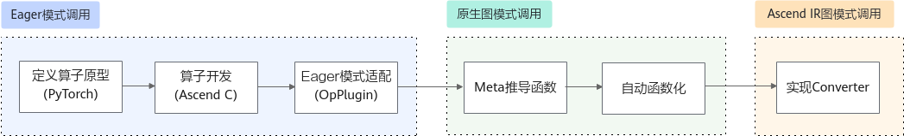

# 确定算子原型

本样例目标是自定义实现一个In-place类PyTorch算子，使其在Eager和TorchAir图模式下正常工作。

假设目标PyTorch[算子Schema](简介.md#常用概念)定义如下：

> **说明：** 
>定义In-place类算子时，需要遵循PyTorch原型定义约定：
>-   **必须显式标记被In-place修改的Tensor输入**，标记方式例如Tensor\(a!\)，a为别名，!表示该输入被修改。
>-   Tensor类型输入在前，基本类型输入在后。
>-   不返回任何被In-place修改的输入。
>为什么遵循这个规则，因为PyTorch 2.6+版本支持函数化自动转换，该特性要求不返回被修改的输入。

```python
- func: my_inplace(Tensor(a!) x, Tensor y) -> Tensor z
```

-   my\_inplace：算子名，对应调用方式为torch.ops.npu.my\_inplace。
-   Tensor\(a!\) x：表示x为Tensor类型输入，\(a!\)表示该输入具有别名a且会被修改。
-   Tensor y：表示y为Tensor类型输入，y不会被修改。
-   -\> Tensor z：表示算子返回一个新的输出z（我们假设z的shape、dtype与y相同，这是后面实现Meta推导函数以及InferShape、InferDataType函数的依据）。

请先完成[环境准备](环境准备.md)，确定好算子原型后，实现目标算子入图的步骤如下：



