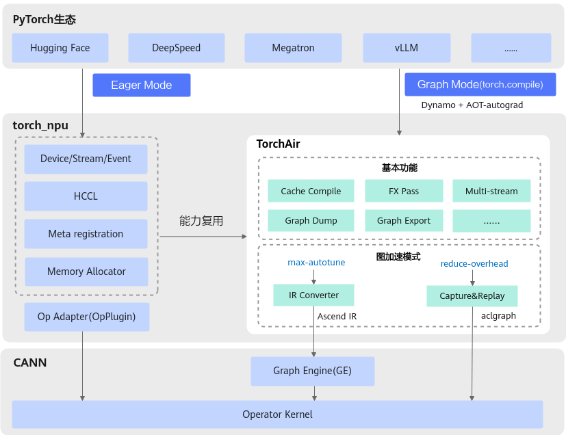

# 简介

## 概述

TorchAir（Torch Ascend Intermediate Representation）是昇腾Ascend Extension for PyTorch（torch\_npu）的图模式能力扩展库，提供了昇腾设备亲和的torch.compile图模式后端，实现了PyTorch网络在昇腾NPU上的图模式**推理加速**以及**性能优化**。

TorchAir在Ascend Extension for PyTorch（torch\_npu）中的位置如[图1](#fig1)所示，图中左侧为单算子执行模式（Eager），右侧为torch.compile图执行模式（Graph）。torch.compile图模式不仅继承了大部分PyTorch原生的[Dynamo特性](https://docs.pytorch.org/docs/main/user_guide/torch_compiler/torch.compiler_dynamo_overview.html)（如动态shape图功能等），还在此基础上新增其他图优化和定位调试能力，例如FX图Pass优化、图内多流并行、集合通信算子入图等，详细功能参见[使用向导](#使用向导)，手册中提到的概念请参考[常用概念](#常用概念)。

目前图执行分为两种模式（可通过[config.mode](reduce-overhead模式配置.md)切换）：

-   **reduce-overhead模式（aclgraph）**：采用Capture&Replay方式实现任务一次捕获多次执行，Capture阶段捕获Stream任务到Device侧，暂不执行；Replay阶段从Host侧发出执行指令，Device侧再执行已捕获的任务，从而减少Host调度开销，提升性能。

    > **说明：** 
    >reduce-overhead模式（aclgraph）又称为捕获模式，该模式通过Runtime提供的aclmdlRICaptureXxx系列接口实现，其原理和接口介绍请参考《CANN 应用开发指南 \(C&C++\)》中“运行时资源管理\>基于捕获方式构建模型运行实例”章节。

-   **max-autotune模式（Ascend IR）**：将PyTorch的FX计算图转换为昇腾中间表示（IR，Intermediate Representation），即Ascend IR计算图，并通过GE（Graph Engine，图引擎）实现计算图的编译和执行。

**图 1**  TorchAir架构图 

## 使用说明

-   **产品定位**：当前版本的TorchAir作为**beta特性**，主要专注于**推理场景**下的模型优化。
-   **前提条件**：在使用TorchAir图模式功能之前，建议先熟悉Ascend Extension for PyTorch基础知识。
    -   参考《Ascend Extension for PyTorch 快速入门》，了解Ascend Extension for PyTorch的概念和作用。
    -   参考《PyTorch 训练模型迁移调优指南》的“模型脚本迁移”章节，了解如何将模型迁移至昇腾NPU上等。
-   **产品支持情况：**
    -   reduce-overhead模式（aclgraph）功能支持的产品情况如下：
        - <term>Atlas A3 训练系列产品/Atlas A3 推理系列产品</term>
        - <term>Atlas A2 训练系列产品/Atlas 800I A2 推理产品</term>
    -   max-autotune模式大部分功能都支持，少数功能产品支持情况有些差异，具体请以每章使用约束为准。
-   **其他约束**：PyTorch图模式支持单进程和多进程，每个进程**只支持使用1张NPU卡**，不支持使用多张NPU卡。

## 使用向导

首次阅读本文时，建议先熟悉下表，它将帮助您快速掌握TorchAir原理和关键技术。此外，本文还将指导您快速上手安装方法、功能配置示例以及API参考等。

**表 1**  使用向导

<table><thead>
  <tr>
    <th>使用场景</th>
    <th>操作指引</th>
    <th>说明</th>
  </tr></thead>
<tbody>
  <tr>
    <td>1. 如何安装TorchAir</td>
    <td><a href="安装.md">安装</a></td>
    <td>介绍TorchAir包获取、安装、版本约束以及依赖的三方库信息等。</td>
  </tr>
  <tr>
    <td>2. 如何配置TorchAir功能</td>
    <td><a href="快速上手.md">快速上手</a></td>
    <td>提供了TorchAir图模式功能配置的简单样例。</td>
  </tr>
  <tr>
    <td rowspan="3">3. TorchAir提供了哪些图功能</td>
    <td><a href="基础功能.md">基础功能</a></td>
    <td>介绍公共的基础图功能，不区分max-autotune或reduce-overhead图执行模式。</td>
  </tr>
  <tr>
    <td><a href="reduce-overhead模式功能.md">reduce-overhead模式功能</a></td>
    <td>绍aclgraph图执行模式下支持的图功能。</td>
  </tr>
  <tr>
    <td><a href="max-autotune模式功能.md">max-autotune模式功能</a></td>
    <td>介绍Ascend IR图执行模式下支持的图功能。</td>
  </tr>
  <tr>
    <td>4. 支持入图的ATen API</td>
    <td><a href="支持的ATen API清单.md">支持的ATen API清单</a></td>
    <td>提供了能在昇腾NPU上以图模式执行的Torch API列表。</td>
  </tr>
  <tr>
    <td>5. 自定义算子如何入图</td>
    <td><a href="自定义算子入图.md">自定义算子入图</a></td>
    <td>针对自定义算子，提供算子开发和适配入图的全流程和样例。</td>
  </tr>
  <tr>
    <td>6. TorchAir提供了哪些API</td>
    <td><a href="API参考.md">API参考</a></td>
    <td>介绍TorchAir图模式功能配置时可能会涉及的接口。</td>
  </tr>
  <tr>
    <td> 7. TorchAir应用案例和常见定位方法</td>
    <td><a href="常见案例和定位方法.md">常见案例和定位方法</a></td>
    <td><li>应用案例：提供LLaMA模型在NPU上以图模式进行推理的样例。</li>
       <li>专题介绍：提供关键技术专题介绍，例如动态图、静态图介绍等。</li>
       <li>定位方法：提供常见入图问题、精度比对和性能分析的方法及案例。</li>
       <li>FAQ：列举图编译/执行过程中可能遇到的系统或环境问题，并提供处理建议。</li>
    </td>
  </tr>
</tbody>
</table>

## 常用概念

本节列举了手册中常用的术语和概念，以帮助您更好地理解关键特性和实现原理。

| 名称 | 说明 |
| --- | --- |
| Eager模式 | 单算子执行模式（未使用torch.compile），特点如下，单击[Link](https://pytorch.org/blog/optimizing-production-pytorch-performance-with-graph-transformations/)获取PyTorch官网介绍。   - 即时执行：每个计算操作在定义后立即执行，无需构建计算图。   - 动态计算图：每次运行可能生成不同的计算图。 |
| 图模式 | 一般指使用torch.compile加速的图执行方式，特点如下：   - 延迟执行：所有计算操作先构成一张计算图，再在会话中下发执行。   - 静态计算图：计算图在运行前固定。 |
| TorchAir图模式 | PyTorch图模式（torch.compile）的一种实现，通过指定TorchAir为其backend的执行方式。 |
| ATen | 全称为A Tensor Library，是PyTorch张量计算的底层核心函数库，这些函数通常称为ATen算子，负责所有张量操作（如加减乘除、矩阵运算、索引等）的C++实现，单击[Link](https://github.com/pytorch/pytorch/tree/main/aten/src/ATen)获取PyTorch官网介绍。 |
| FX图 | Functionality Graph，PyTorch中用于表示模型计算流程的中间层数据结构。通过符号化追踪代码生成计算图，将Python代码转为中间表示（IR，Intermediate Representation），实现计算图的动态调整和优化（如量化、剪枝等），单击[Link](https://docs.pytorch.org/docs/stable/fx.html)获取torch.fx详情。 |
| GE | Graph Engine，图引擎。它是计算图编译和运行的控制中心，提供图优化、图编译管理以及图执行控制等功能。 GE通过统一的图开发接口提供多种AI框架的支持，不同AI框架的计算图可以实现到Ascend IR图的转换，单击[Link](https://www.hiascend.com/graph-engine)获取详情。 |
| Pass | 在深度学习框架（如PyTorch）和编译器（如TVM）中，Compiler Passes（编译器传递）和Partitioners（分区器）是优化图执行的关键技术，用于性能优化、硬件适配和计算图转换等，而Pass则是指在这些计算图上执行的特定变换操作。常见的Pass操作包括常量折叠、算子融合、内存优化等，单击[Link](https://docs.pytorch.org/executorch/stable/compiler-custom-compiler-passes.html)获取PyTorch官网详情。 FX Pass是指对计算图（torch.fx.Graph）进行遍历、分析和转换等一系列操作，类似于传统编译器中的优化步骤（如常量折叠、算子融合）。 |
| In-place算子 | 原地算子，该类算子可直接修改输入数据，不创建新的存储空间。从而节省内存，避免复制数据的开销。 |
| Out-of-place算子 | 非原地算子，又称“非In-place算子”，该类算子保持原始输入数据不变，会创建并返回新对象，带来额外存储开销。 |
| 算子Schema | 在PyTorch中，算子Schema（Operator Schema）定义了算子的输入、输出、属性以及行为规范，确保算子在正向传播（Forward）和反向传播（Backward）时能正确执行。PyTorch使用Schema来注册算子，并在编译或运行时进行验证。算子Schema主要通过修改native_functions.yaml文件实现，该文件位于PyTorch源码的[aten/src/ATen](https://github.com/pytorch/pytorch/blob/main/aten/src/ATen/native/native_functions.yaml)目录下，用于声明算子的名称、参数类型、返回值类型及设备端实现函数。 |
| Ascend C | CANN编程语言，原生支持C和C++标准规范，兼具开发效率和运行性能。基于Ascend C编写的算子程序，通过编译器编译和运行时调度，运行在昇腾AI处理器上。开发的算子简称为Ascend C算子，其调用方式一般为aclnnXxx的C接口形式，具体介绍请参考[《CANN Ascend C算子开发指南》](https://hiascend.com/document/redirect/CannCommunityOpdevAscendC)。 |
| OpPlugin | Ascend Extension for PyTorch（torch_npu）算子插件，为使用PyTorch框架的开发者提供便捷的NPU算子库调用能力，具体介绍参考[Ascend/OpPlugin仓](https://gitcode.com/Ascend/op-plugin/tree/master)，而算子适配开发过程参考《PyTorch 框架特性指南》中的“基于OpPlugin算子适配开发”章节。 |

