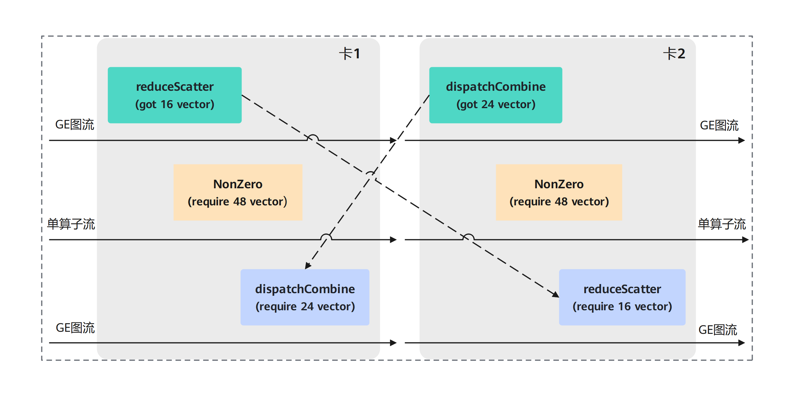

# Eager和图模式下控核介绍

## 简介

在多流集合通信场景下，AIV模式会存在核占满情况，此时如果进行全核同步，可能会出现死锁情况，导致用户脚本卡死。

例如在以下多流路并发场景中，设备总Vector核数为48个核。此时：

- 卡1的reduceScatter算子获取到16个vector核，卡2的dispatchCombine算子获取到24个vector核。
- NonZero算子需要一次性拿到48个vector核才会执行，并且会占用设备上的剩余核数。
- NonZero算子占用了卡1上剩余的32核，导致dispatchCombine算子无法获取所需的核数执行。卡2上NonZero算子占用了剩余的24核，导致reduceScatter算子无法执行。
- 卡1上的NonZero算子等待reduceScatter算子释放核，而reduceScatter算子等待卡2上的reduceScatter算子执行。
- 卡2上的NonZero算子等待dispatchCombine算子释放核，但dispatchCombine算子依赖卡1上的dispatchCombine算子获取到核执行。
- 卡1和卡2互相等待，导致卡1和卡2互锁卡死，算子因获取不到核导致超时。

对此，可通过对阻塞算子（NonZero）进行控核来解决。

**图 1**  多Stream并发场景卡死场景 



## 使用方法

为解决上述问题，torch_npu提供了单算子（Eager）模式、GE图模式、aclgraph模式下的控核能力。

注意，多流场景下使用控核时，任意两条流使用的核总数不能超过当前设备核的总数。

### Eager模式

单算子使用场景下，支持对算子进行进程级和Stream级的控核。

- 进程级控核

    ```python
    # 获取指定Device上的device资源限制
    torch.npu.get_device_limit(device) -> Dict

    # 设置指定Device的Device资源限制
    torch.npu.set_device_limit(device, cube_num=-1, vector_num=-1) -> None
    ```

- Stream级控核

    ```python
    # 获取指定Stream的device资源限制
    torch.npu.get_stream_limit(stream) -> Dict

    # 设置指定Stream的Device资源限制
    torch.npu.set_stream_limit(stream, cube_num=-1, vector_num=-1) -> None

    # 重置指定Stream的Device资源限制
    torch.npu.reset_stream_limit(stream) -> None
    ```

以Stream级控核为例，示例代码如下：

```python
import torch
import torch_npu

batch_size = 2
hidden_size = 16
x = torch.randn(batch_size, hidden_size).npu()
stream = torch.npu.current_stream()

torch.npu.set_stream_limit(stream, 3, 8)
with torch.npu.stream(stream):
    output = torch_npu.npu_swiglu(x, dim=-1)
```

### 图模式

在reduce-overhead模式和GE图模式下，可以使用同一套接口进行算子的Stream级控核。接口如下：

```python
with torchair.scope.limit_core_num(op_aicore_num: int, op_vector_num: int )
```

使用如上with语句块，语句块内的算子均使用入参指定核数。

- op_aicore_num：表示算子运行时的最大AI Core数，取值范围为[1, max_aicore]。
- op_vectorcore_num：表示算子运行时的最大Vector Core数，取值范围为[1, max_vectorcore]。

其中max_aicore和max_vectorcore表示设备的实际AI Core、Vector Core数，具体示例如下：

```python
import torch
import torch_npu
import torchair
from torchair.config.compiler_config import CompilerConfig
class Model(torch.nn.Module):
    def __init__(self):
        super.__init__()
    
    def forward(self, x):
        mm_result = torch.mm(x, x)
        with torchair.scope.limit_core_num(6, 12):
            add_result = torch.add(x, x)
        return mm_result, add_result

config = CompilerConfig()
config.mode = "reduce-overhead"
aclgraph_backend = torchair.get_npu_backend(compiler_config=config)
model = Model()
opt_model = torch.compile(model, backend=aclgraph_backend, fullgraph=True, dynamic=False)
x = torch.randn([3, 3])
model(x)
```

GE图模式在Stream级控核的基础上还提供了全局级别控核（Session级），请参考[图内AI Core和Vector Core全局核数配置](图内AI-Core和Vector-Core全局核数配置.md)。

## 使用说明

### 不同算子控核说明


- **计算算子**：
- Ascend C算子：AI Core、AI Vector算子控核生效，AI CPU算子不生效。
  
- TBE算子：AI Vector算子控核生效。
  
- ATB算子：控核不生效。
  
- **通信算子**：
- HCCL算子：AI Vector算子控核生效，AI CPU算子不生效。
  
- MC2算子：AI Vector算子控核生效。

### aclgraph与静态Kernel共同使能

在当前处理逻辑中，支持静态编译的计算算子在静态编译后失去了Tiling的行为。这意味着除非在编译态能够传递算子的核数，否则无法对此类算子进行控核。

**当前阶段**通信算子没有静态Kernel，在执行的时候能够正常获取核数，不影响控核的生效。

当同时开启静态Kernel和控核的情况下，对于静态Kernel能生效的算子，控核不生效。
