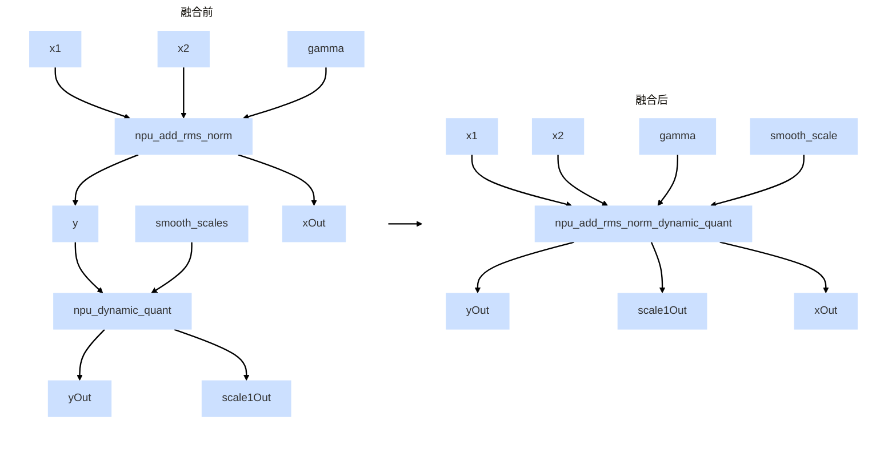
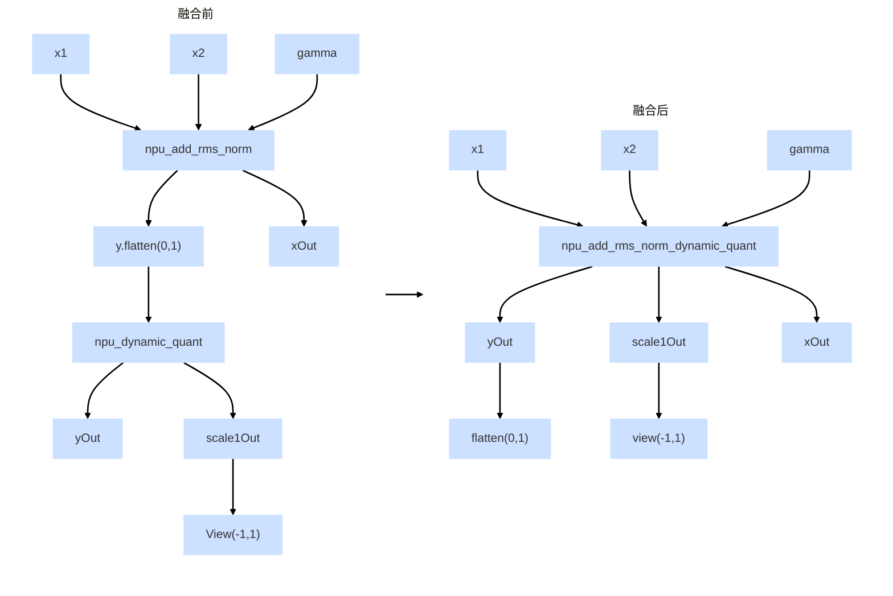
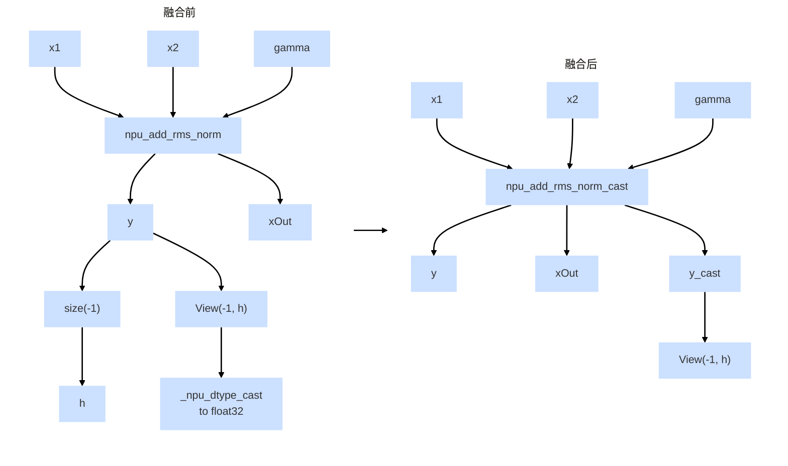
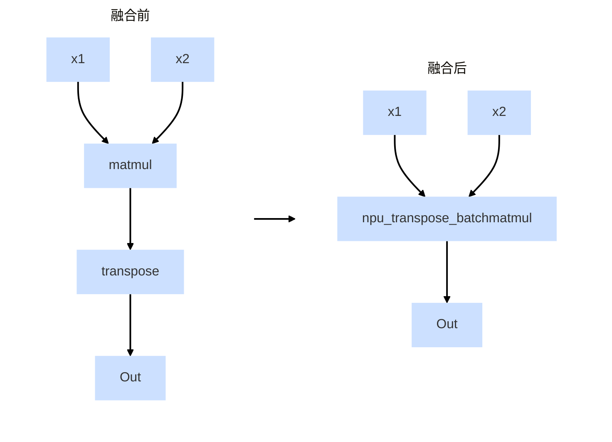
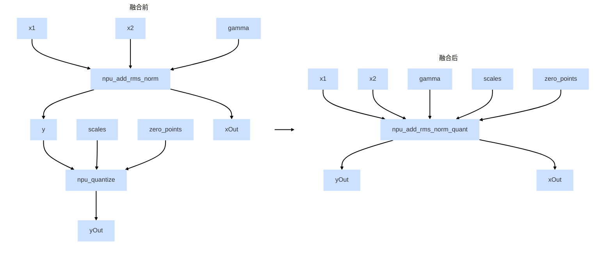

# FX图算子融合Pass配置

## 功能简介

图模式下，TorchAir集成了PyTorch原生Pattern能力的算子融合功能，能够通过特定的算子替换规则，使用融合算子替换FX图中多个算子。这种优化可以有效减少部分场景下不必要的下发开销，提高模型执行效率。当与其它图优化策略结合使用时，可通过优化对比来选择最佳方案。

目前TorchAir提供了多种**默认的算子融合Pass**（适用于Deepseek、Long-Cat等网络），参见[表1](#table1)，符合替换规则的算子组合可被替换成对应的融合算子。

**表 1**  已支持的算子融合Pass  <a name="table1"></a>


| 替换规则 | 对应的融合算子 |
| --- | --- |
| npu_add_rms_norm输出直接作为npu_dynamic_quant（含smooth_scales参数）输入 | npu_add_rms_norm_dynamic_quant |
| npu_add_rms_norm输出经flatten(0,1) 后作为npu_dynamic_quant（不含smooth_scales参数）输入，且npu_dynamic_quant输出的scaleOut执行view(-1,1) | npu_add_rms_norm_dynamic_quant（并处理flatten与view操作） |
| npu_add_rms_norm输出先获取最后一维尺寸h，再经view(-1, h)变形及to(torch.float32)类型转换 | npu_add_rms_norm_cast（并处理view） |
| matmul输出作为transpose输入，transpose参数仅支持(0,1)或者(1,0) | npu_transpose_batchmatmul |
| npu_add_rms_norm输出作为npu_quantize输入，npu_add_rms_norm输入尾轴需32B对齐，并满足融合算子npu_add_rms_norm_quant约束条件 | npu_add_rms_norm_quant |

各融合Pass的算子替换逻辑参见[融合规则](#融合规则)，融合算子的输出被正常使用，且融合后不再存在的中间结果不得被其他位置使用，否则无法融合。另外，用户可通过[register\_replacement](register_replacement.md)接口**实现自定义算子融合Pass注册**（参见接口调用示例），注意需自行保证融合规则的正确性。

## 使用约束

-   本功能依赖PyTorch 2.6.0或更高版本。
-   无论是默认支持的算子融合Pass还是自定义的算子融合Pass，均可由pattern\_fusion\_pass配置。
-   表1中matmul输入必须是三维，npu_transpose_batchmatmul及npu_add_rms_norm_quant算子融合max-autotune模式不生效。

## 使用方法

该功能通过[torchair.get\_npu\_backend](get_npu_backend.md)中compiler\_config配置，**默认开启**，关闭的示例如下，仅供参考不支持直接拷贝运行，参数介绍参见[表2](#table2)。

```python
import torch_npu
import torchair
config = torchair.CompilerConfig()
# FX图中算子融合Pass配置
config.experimental_config.pattern_fusion_pass = False
npu_backend = torchair.get_npu_backend(compiler_config=config)
opt_model = torch.compile(model, backend=npu_backend)
```

**表 2**  参数说明 <a name="table2"></a>


| 参数名 | 说明 |
| --- | --- |
| pattern_fusion_pass | FX图是否开启算子融合Pass配置，布尔类型。<br>- False：关闭。<br>- True（默认值）：开启。 |

设置成功后，参考[图结构dump功能](图结构dump功能.md)开启FX图dump，假设原始FX图满足npu\_add\_rms\_norm\_dynamic\_quant的替换规则，可从图结构中看到如下类似的信息，打印信息表明已经存在对应融合算子。

```
# No stacktrace found for following nodes
npu_add_rms_norm_dynamic_quant_default = torch.ops.npu.npu_add_rms_norm_dynamic_quant.default(arg2_1, arg1_1, arg0_1, output_mask = [True, True]);  arg2_1 = arg1_1 = arg0_1 = None
getitem_5: "i8[2, 3, 4]" = npu_add_rms_norm_dynamic_quant_default[0]
getitem_6: "f16[2, 3, 4]" = npu_add_rms_norm_dynamic_quant_default[2]
getitem_7: "f32[2, 3]" = npu_add_rms_norm_dynamic_quant_default[3];  npu_add_rms_norm_dynamic_quant_default = None
view_default: "i8[6, 4]" = torch.ops.aten.reshape.default(getitem_5, [6, 4]);  getitem_5 = None
view_default_1: "f32[6, 1]" = torch.ops.aten.reshape.default(getitem_7, [-1, 1]);  getitem_7 = None
return (view_default, view_default_1, getitem_6)
```

## 融合规则
-   npu_add_rms_norm_dynamic_quant


-   npu_add_rms_norm_dynamic_quant（并处理flatten与view操作）

-   npu_add_rms_norm_cast（并处理view） 


-   npu_transpose_batchmatmul

-   npu_add_rms_norm_quant

