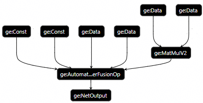
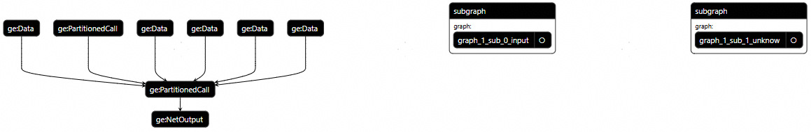

# GE动/静态图展示

本章沿用[Dynamo动/静态图展示](Dynamo动-静态图展示.md)提供的样例脚本test\_compile.py。运行该脚本，通过TorchAir的编译日志或Dump的GE build图来判断编译后的图是否完全静态下沉调度。

Dump GE图参见《CANN 环境变量参考》中的“DUMP\_GE\_GRAPH”章节，dump的图文件一般为txt、pbtxt两种格式，txt文件比pbtxt文件多保存了一些属性信息，pbtxt文件可使用Netron等可视化软件打开。

-   txt格式判断：build图中**如果存在graph的\_graph\_unknown\_flag属性值，且取值为true**则为非完全静态下沉调度，否则为完全静态下沉调度。
-   pbtxt：下面分别提供不同场景下的图信息展示，其中GE build图通过可视化的pbtxt格式展示。

## dynamic=False，GE编译结果为静态shape图 <a name="scene1"></a>

-   通过TorchAir编译日志判断编译结果

    ```bash
    [INFO] TORCHAIR(1630010,python):2025-11-07-15:35:41.717.513 [concrete_graph/concrete_graph.cpp:246]1630010 Static FX graph compiled to static Ascend GE graph, graph id: 0
    ```

    “static Ascend GE graph”标识表明这是一个完全静态下沉调度的图。

-   GE build图

    

## dynamic=True，GE编译结果为动态shape图<a name="scene2"></a>

-   通过TorchAir编译日志判断编译结果

    ```bash
    [INFO] TORCHAIR(1632429,python):2025-11-07-15:38:03.235.847 [concrete_graph/concrete_graph.cpp:246]1632429 Dynamic FX graph compiled to dynamic Ascend GE graph, graph id: 0
    ```

-   GE build图

    

## dynamic=True且对输入mark\_static，GE编译结果为静态shape图<a name="scene3"></a>

-   通过TorchAir编译日志判断编译结果

    ```bash
    [INFO] TORCHAIR(1639859,python):2025-11-07-15:45:43.284.466 [concrete_graph/concrete_graph.cpp:246]1639859 Static FX graph compiled to static Ascend GE graph, graph id: 0
    ```

-   GE build图

    

本场景与[dynamic=False，GE编译结果为静态shape图](#scene1)均为GE静态shape图，但图结构不同，本图多了一个**Cast节点**。原因是TorchAir Converter会将torch.SymInt（即[dynamic=True且对输入mark\_static，Dynamo编译结果为静态图](Dynamo动-静态图展示.md#scene1)中原生FX图结构里的**input 4: s0**）转换为DT\_INT64类型，而后续计算是DT\_FLOAT格式，因此需通过Cast将数据从DT\_INT64转换为DT\_FLOAT。

