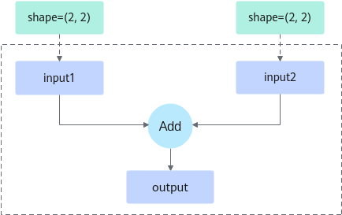

# 动态shape图分档执行功能

## 功能简介

当用户网络中仅Batch的少量维度发生了变化，且维度变化的范围是有限的、可被枚举的，可以开启动态shape图分档功能。通过将一张图划分为不同档位的方式，使一张图能支持多Batch，提升网络执行性能。

-   对于纯静态图，动态shape分档功能允许输入Tensor的shape在指定的档位上变化，而静态图shape不允许变化。
-   对于纯动态图，不分档的动态图中支持的shape变化范围大于分档的动态图，而多出来的shape变化范围很可能不是业务场景所需要的，因此动态图的执行性能会比分档后的动态图性能差。

此处以[图1](#fig1)为例，阐述三种图执行方式的差异。假设用户图只有Add算子，存在input1、input2、output三个Tensor。编译该图时传入的input1与input2的shape都为\(2, 2\)，而用户实际输入时input1与input2的shape有\(2, 2\)、\(2, 2\)与\(4, 2\)、\(4, 2\)两种。

**图 1**  Add算子示意图  <a name="fig1"></a>



-   静态图执行：

    当torch.compile参数dynamic=False时，编译出的图仅支持shape为input1 \(2, 2\)、input2 \(2, 2\)，此时执行性能最优，但支持的shape并不满足input1为\(4, 2\)、input2为\(4, 2\)的场景。如果输入的shape为input1 \(4, 2\)，input2 \(4, 2\)，将会再次触发编译流程。

-   动态图执行：

    当torch.compile参数dynamic=True时，编译出的图支持shape为input1 \(-1, -1\)、input2 \(-1, -1\)，此时图不仅支持input1与input2 shape为\(2, 2\)、\(4, 2\)两种场景，还支持\(3, 3\)、\(4, 4\)等任意input1与input2 shape相等的场景。由于动态图中算子的shape可变，无法一次将图中任务全部下发至Device计算，只能先下发一部分，返回计算结果后再下发另一部分，因此其执行性能比静态图差。

    > **说明：** 
    >shape中的“-1”表示该轴支持任意值，取值范围为1\~正无穷。

-   动态shape图分档执行：

    torch.compile或[模型编译缓存功能（aclgraph）](模型编译缓存功能（aclgraph）.md)编译出的图支持shape为input1 \(-1, 2\)、input2 \(-1, 2\)  。“-1”可被动态分档，假设其支持的分档维度为2和4。

    -   维度为2时：input1 shape为\(2, 2\), input2 shape为\(2, 2\)
    -   维度为4时：input1 shape为\(4, 2\), input2 shape为\(4, 2\)

    换言之整个分档图只支持这两种shape规格的输入。如果开启动态shape分档，会将每个档位的图转换为静态子图，能一次全部下发到Device侧，因此执行性能优于动态图。

## 使用约束

-   本功能仅支持max-autotune模式，暂不支持同时配置[Dynamo导图功能](Dynamo导图功能.md)、[RefData类型转换功能](RefData类型转换功能.md)。
-   本功能仅适用于整图优化场景。
-   [set\_dim\_gears](set_dim_gears.md)需和torch.compile中的dynamic=True搭配使用。因为set\_dim\_gears只会符号化入参指定的Tensor及维度，其他scalar值的符号化会在dynamic=True时由Dynamo自动完成。
-   本功能要求网络中参与分档的Tensor不能传入私有格式，如FRACTAL\_NZ、NC1HWC0等。

## 使用方法

以[图1](#fig1)为例，动态分档的关键操作如下：

1.  在模型脚本中通过[set\_dim\_gears](set_dim_gears.md)接口设置档位。<a name="li1"></a>

    > **说明：** 
    >-   支持对同一个Tensor设置一个或者多个维度的档位。
    >-   若图编译、执行时Tensor的shape不在设置的档位中，会导致编译或执行报错，请合理设置档位值。
    >-   不支持对同一个Tensor使用该接口设置两次不一样的档位。
    >-   生成的总档位数量不超过100，档位值不能包含0或1，因为动态FX graph中dim值符号化的最大表示范围是\[2, ∞\)，因此当dim为0或1时，不会命中动态的FX graph，需要重新成图，因此无法执行分档流程。
    >-   首次执行时对输入Tensor设置档位即可，保证首次编译时能够获取到档位，后续执行时无需设置档位，避免因为设置档位的动作引发性能下降。

    ```python
    import torch, torch_npu, torchair
    input1 = torch.ones(2, 2).npu()
    input2 = torch.ones(2, 2).npu()
    torchair.inference.set_dim_gears(input1, dim_gears={0:[2, 4]})
    torchair.inference.set_dim_gears(input2, dim_gears={0:[2, 4]})
    ```

2.  （可选）在模型脚本中设置动态分档的组合模式。<a name="li2"></a>

    通过[torchair.get\_npu\_backend](get_npu_backend.md)中compiler\_config配置，示例如下，仅供参考不支持直接拷贝运行，参数说明如下表。

    ```
    import torch_npu, torchair
    config = torchair.CompilerConfig()
    # 动态分档组合模式配置
    config.inference_config.dynamic_gears_merge_policy = "zip"
    npu_backend = torchair.get_npu_backend(compiler_config=config)
    opt_model = torch.compile(model, backend=npu_backend)
    ```

    **表 1**  参数说明

    
    | 参数名 | 说明 |
    | --- | --- |
    | dynamic_gears_merge_policy | 指定动态分档组合模式。若采用zip模式配置档位繁琐时，可使用product模式配置。<br>- zip（默认值）：按位置一一对应。<br>- product：排列组合，可以根据笛卡尔积组合成更多的档位。 |

    **说明**：

     举个例子，当input3输入的shape为(2, 10)，若想要对其划分6个档位(2, 10)、(3, 10)、(4, 10)、(2, 20)、(3, 20)、(4, 20)，两种组合模式的配置代码如下：  

	- zip模式，档位配置复杂
	
      ```python
      torchair.inference.set_dim_gears(input3, dim_gears={0:[2, 3, 4, 2, 3, 4], 1:[10, 10, 10, 20, 20, 20]})
      ```
    
    - product模式，档位配置简单
      
      ```python
      torchair.inference.set_dim_gears(input3, dim_gears={0:[2, 3, 4], 1:[10, 20]})
      ```
    
    按[步骤1](#li1)中配置，不同组合模式的档位结果如下：
    
    - zip：input1、input2支持的动态分档维度均为2和4，按位置一一对应有2种排列组合方式，即input1、input2的shape支持\(2, 2\)、\(2, 2\)与\(4, 2\)、\(4, 2\)两种档位。
    - product：input1、input2支持的动态分档维度均为2和4，按笛卡尔积有4种排列组合方式，即input1、input2的shape支持\(2, 2\)、\(2, 2\)；\(2, 2\)、\(4, 2\)；\(4, 2\)、\(2, 2\)；\(4, 2\)、\(4, 2\)四种档位。其中input1、input2的shape为\(2, 2\)、\(4, 2\)与\(4, 2\)、\(2, 2\)两种档位在[图1](#fig1)中不符合相同shape相加的规则。

## 后续操作

在模型脚本中设置动态分档后，再次执行模型脚本，验证分档结果是否符合预期。

假设模型脚本定义如下：

```python
import torch
import torch_npu
import torchair
from torchair.configs.compiler_config import CompilerConfig

class Model(torch.nn.Module):
    def __init__(self):
        super().__init__()
    def forward(self, x1, x2):
        return x1 + x2

config = CompilerConfig()
# 默认为zip模式，也支持设置product模式
# config.inference_config.dynamic_gears_merge_policy = "zip"
npu_backend = torchair.get_npu_backend(compiler_config=config)
model = Model().npu()
# 必须整图编译
model = torch.compile(model, fullgraph=True, backend=npu_backend)
npu_input0 = torch.ones([2, 2]).npu()
npu_input1 = torch.ones([2, 2]).npu()
# 设置档位
torchair.inference.set_dim_gears(npu_input0, {0: [2, 4]})
torchair.inference.set_dim_gears(npu_input1, {0: [2, 4]})
# 首次编译+执行，shape为（2，2）、（2，2）
print(model(npu_input0, npu_input1))

# 再次执行，shape为（4，2）、（4, 2）在档位中，不会触发重新编译
npu_input0 = torch.ones([4, 2]).npu()
npu_input1 = torch.ones([4, 2]).npu()
print(model(npu_input0, npu_input1))
```

开启[TorchAir C++层日志](TorchAir-C++层日志.md)，会打印图被划分的档位信息：

```
[INFO] TORCHAIR [concrete_graph/concrete_graph.cpp:123] Compiling concrete graph 0 with options:
[INFO] TORCHAIR [concrete_graph/concrete_graph.cpp:125]     ge.deterministic = 0
[INFO] TORCHAIR [concrete_graph/concrete_graph.cpp:125]     ge.dynamicDims = 2,2;4,4
[INFO] TORCHAIR [concrete_graph/concrete_graph.cpp:125]     ge.dynamicNodeType = 1
[INFO] TORCHAIR [concrete_graph/concrete_graph.cpp:125]     ge.exec.atomicCleanPolicy = 1
[INFO] TORCHAIR [concrete_graph/concrete_graph.cpp:125]     ge.exec.memoryOptimizationPolicy = MemoryPriority
[INFO] TORCHAIR [concrete_graph/concrete_graph.cpp:125]     ge.exec.outputReuseMemIndexes = 0
[INFO] TORCHAIR [concrete_graph/concrete_graph.cpp:125]     ge.exec.reuseZeroCopyMemory = 1
[INFO] TORCHAIR [concrete_graph/concrete_graph.cpp:125]     ge.featureBaseRefreshable = 0
[INFO] TORCHAIR [concrete_graph/concrete_graph.cpp:125]     ge.inputShape = arg1_1:-1,2;arg2_1:-1,2
[INFO] TORCHAIR [concrete_graph/concrete_graph.cpp:125]     ge.jit_compile = 2
[INFO] TORCHAIR [concrete_graph/concrete_graph.cpp:125]     ge.topoSortingMode = 1
```

对应支持的档位如下，符合用户预期的档位。

-   档位1：npu\_input0 shape=\(2, 2\)，npu\_input1 shape=\(2, 2\)。
-   档位2：npu\_input0 shape=\(4, 2\)，npu\_input1 shape=\(4, 2\)。

