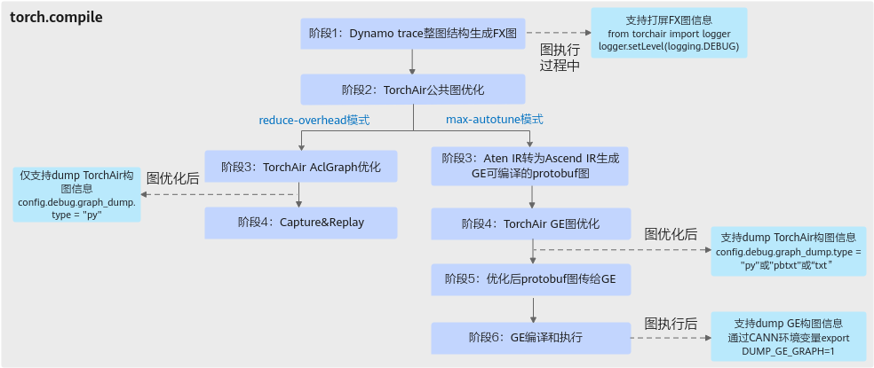
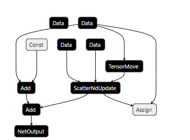

# 图结构dump功能

## 功能简介

图模式场景下，如果模型执行出现异常（如模型精度不准确），可通过导出图结构来查看图执行节点信息，从而进行模型问题的分析和排查。

**图 1**  图结构dump  <a name="fig1"></a>



## 使用方法

1.  图执行过程中，开启Python层日志，可以打印原生FX图结构信息。

    ```python
    import logging
    from torchair import logger
    logger.setLevel(logging.DEBUG)
    ```

    图结构信息示例如下:

    ```text
    [INFO] TORCHAIR(2476445,python):2025-04-09 16:02:54.452.689 [npu_fx_compiler.py:364]2476445   graph: graph():
        %arg0_1 : [num_users=1] = placeholder[target=arg0_1]
        %arg1_1 : [num_users=1] = placeholder[target=arg1_1]
        %select_scatter : [num_users=1] = call_function[target=torch.ops.aten.select_scatter.default](args = (%arg0_1, %arg1_1, 0, 1), kwargs = {})
        %mul : [num_users=1] = call_function[target=torch.ops.aten.mul.Tensor](args = (%select_scatter, 10), kwargs = {})
        return (mul,)
    ```

2. 图执行完成后，支持dump TorchAir构图信息。

    该功能通过[torchair.get\_npu\_backend](get_npu_backend.md)中compiler\_config配置，示例如下，仅供参考不支持直接拷贝运行，参数说明如下表。

    ```python
    import torch_npu, torchair
    config = torchair.CompilerConfig()
    # 设置图结构Dump参数
    config.debug.graph_dump.type = "pbtxt"
    config.debug.graph_dump.path = "./test"
    npu_backend = torchair.get_npu_backend(compiler_config=config)
    opt_model = torch.compile(model, backend=npu_backend)
    ```

    **表 1**  参数说明
    
    |  参数名 |  参数说明  |
    |------|-------|
    |graph_dump.type|设置导出图结构文件的格式，字符串型。默认为“None”，表示不导出图结构信息。支持导出的格式：<br> ①py：dump ATen IR转换为Ascend IR后的构图信息，即[图1](#fig1)中阶段2构图信息，可通过Vscode等工具查看。<br> ②txt：dump最终接收到的TorchAir构图结果，可通过Vscode等工具查看。<br> ③pbtxt：dump最终接收到的TorchAir构图结果，为Protobuf格式，可通过TensorBoard、Netron等工具查看。 |
    |graph_dump.path|设置图结构文件生成的路径，字符串型。可选配置，如果不设置，默认路径为当前执行路径。|
    

    **说明**： 
    
    - 当[config.mode](reduce-overhead模式配置.md)为reduce-overhead模式，上述dump文件格式仅支持*.py。      
    - 当[config.mode](reduce-overhead模式配置.md)为max-autotune模式，上述dump文件格式均支持。     
    - 多次定义导出格式时，以最后一次定义的格式为准。     
    - 不支持txt、pbtxt、py三种格式同时导出。
    

3.（可选）当[config.mode](reduce-overhead模式配置.md)为max-autotune模式，如需查看GE图编译和执行后的图结构信息，请参考[《CANN 环境变量参考》](https://hiascend.com/document/redirect/CannCommunityEnvRef)中的“DUMP\_GE\_GRAPH”章节开启GE的dump图信息。

## 产物说明

图结构dump的结果文件如下

-   `dynamo_original_graph_${graph_id}_rank_${rank_id}_pid_${pid}_ts_${timestamp}.${graph_dump_type}`：模型原始图结构文件，例如dynamo\_original\_graph\_1\_rank\_15\_pid\_421214\_ts\_20251010083825327878.py。
-   `dynamo_optimized_graph_${graph_id}_rank_${rank_id}_pid_${pid}_ts_${timestamp}.${graph_dump_type}`：优化后的模型图结构文件，例如dynamo\_optimized\_graph\_1\_rank\_15\_pid\_421214\_ts\_20251010083827311204.py。

其中\$\{graph\_id\}表示第几张图，\$\{rank\_id\}表示图执行的通信卡id，\$\{pid\}表示图执行的进程号，\$\{timestamp\}表示时间戳，\$\{graph\_dump\_type\}表示导图文件格式，不同格式的样例如下：

-   **py文件样例**

    ```python
    from torch import tensor
    from torchair._ge_concrete_graph import ge_apis as ge
    from torchair.ge._ge_graph import get_default_ge_graph
    
    arg0_1_0 = ge.Data(index=0, dtype=0, shape=[2, 2, 2], placement="NPU", node_name="arg0_1")
    arg1_1_0 = ge.Data(index=1, dtype=0, shape=[2], placement="NPU", node_name="arg1_1")
    
    # File "/home/torchair_example/tests/examples/example_select_scatter.py", line 23, in forward output = torch.ops.aten.select_scatter(x, y, 0,1)
    ## FX Code: select_scatter = torch.ops.aten.select_scatter.default(arg0_1, arg1_1, 0, 1)
    Shape_0 = ge.Shape(arg0_1_0, node_name="Shape")
    BroadcastTo_0 = ge.BroadcastTo(1, Shape_0, node_name="BroadcastTo")
    ExpandDims_0 = ge.ExpandDims(arg1_1_0, 0, node_name="ExpandDims")
    BroadcastTo_1_0 = ge.BroadcastTo(ExpandDims_0, Shape_0, node_name="BroadcastTo_1")
    ScatterElements_0 = ge.ScatterElements(arg0_1_0, BroadcastTo_0, BroadcastTo_1_0, axis=0, node_name="ScatterElements")
    
    # File "/home/torchair_example/tests/examples/example_select_scatter.py", line 24, in forward return output*10
    ## FX Code: mul = torch.ops.aten.mul.Tensor(select_scatter, 10)
    Mul_0 = ge.Mul(ScatterElements_0, ge.Const(10, dtype=0), node_name="Mul")
    Cast_0 = ge.Cast(Mul_0, dst_type=0, node_name="Cast")
    
    _ = ge.NetOutput([Cast_0], dependencies=[])
    ```

-   **pbtxt文件样例**

    

-   **txt文件样例**

    ```text
    name: "graph_1"
    op {
      name: "arg0_1"
      type: "Data"
      attr {
        key: "_input_name_key"
        value {
          list {
            s: "x"
          }
        }
      }
      input_desc {
        name: "x"
        dtype: DT_FLOAT
        shape {
          dim: 2
          dim: 2
          dim: 2
        }
        layout: "ND"
        device_type: "NPU"
      }
      output_desc {
        name: "y"
        dtype: DT_FLOAT
        shape {
          dim: 2
          dim: 2
          dim: 2
        }
        layout: "ND"
        attr {
          key: "_meta"
          value {
            s: "Tensor(dtype=torch.float32, shape=torch.Size([2, 2, 2]))"
          }
        }
        attr {
          key: "format_for_int"
          value {
            i: 2
          }
        }
        device_type: "NPU"
      }
    }
    .........
    op {
      name: "arg1_1"
      type: "Data"
      attr {
        key: "_input_name_key"
        value {
          list {
            s: "x"
          }
        }
      }
      ......
    }
    ```

