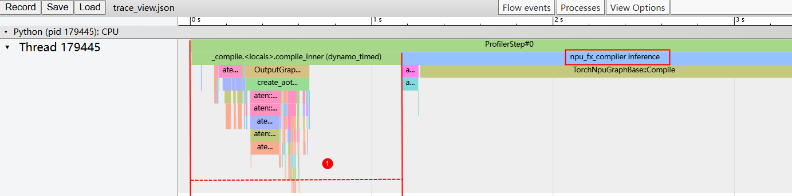
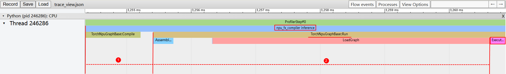

# 性能分析案例

假设有一个PyTorch模型，其执行性能未达预期，前期已在脚本中插入了关键阶段的打印信息，发现模型执行前的初始头开销异常。此时，需要使用CANN提供的性能调优（Profiling）工具采集性能数据，以便进一步分析原因，分析步骤大致如下：

1.  获取图模式下模型Profiling数据。<a name="step1"></a>

    使用**Ascend PyTorch Profiler接口**采集性能数据，主要包括PyTorch层算子信息、CANN层算子信息、底层NPU算子信息以及算子内存占用信息等。

    > **说明：** 
    >**Ascend PyTorch Profiler**是CANN针对PyTorch框架开发的性能分析工具，通过在PyTorch脚本中添加**Ascend PyTorch Profiler接口**（推荐torch\_npu.profiler.profile接口）采集指定指标数据，模型执行时同步采集性能数据，详细的使用方法和结果文件介绍请参考《CANN 性能调优工具用户指南》中的“Ascend PyTorch Profiler”章节。

    ```python
    import logging
    import torch
    import torch_npu
    import torch.nn as nn
    import torchair as tng
    from torchair.core.utils import logger
    from torchair.configs.compiler_config import CompilerConfig
    
    logger.setLevel(logging.DEBUG)
    torch.npu.config.allow_internal_format=False
    torch.npu.set_device('npu')
    # 设备选择，可以是CPU或GPU
    device = torch.device("cuda" if torch.cuda.is_available() else "cpu")
    
    # 设置图模式config
    config = CompilerConfig()
    # True为Eager模式执行，False或不设置默认为图模式执行
    # config.debug.run_eagerly = True
    npu_backend = tng.get_npu_backend(compiler_config=config)
    
    # 自定义模型
    class MyModule(nn.Module):
        def __init__(self):
            super(MyModule, self).__init__()
            # 定义ConvTranspose3d层
            self.conv_transpose = nn.ConvTranspose3d(256, 16, kernel_size=3, stride=2, padding=1)
        def forward(self, x, y):
            # 使用torch.lt操作
            # lt_result = torch.lt(x, 0.5)
            # 使用Tensor.asin操作
            # asin_result = lt_result.asin()
            # asin_result = torch.asin(x)
            # 使用ConvTranspose3d操作，假设输入形状为[1, 256, 22, 34, 34]
            # transposed_output = self.conv_transpose(asin_result)
            # return transposed_output
            out = torch.ops.aten.split_with_sizes.default(x, y, 2)
            out_tensor = out[0] + 1
            return out_tensor
    
    # 创建模块实例并移动到指定设备
    module = MyModule().to(device)
    # 使用torch.compile编译
    module = torch.compile(module, fullgraph=True, backend=npu_backend, dynamic=True)
    
    # 测试模块，创建一个输入张量
    input_tensor = torch.randn(1664, 1, 4, device=device)
    input_tensor = torch.transpose(input_tensor, 0, 2)
    # 配置采集任务
    experimental_config = torch_npu.profiler._ExperimentalConfig(profiler_level=torch_npu.profiler.ProfilerLevel.Level2)
    with torch_npu.profiler.profile(
      with_stack=False,                # 采集算子的函数调用栈开关，默认关闭
      record_shapes=False,             # 采集算子的input shape和input type开关，默认关闭
      profile_memory=False,            # 采集memory相关数据开关，默认关闭
      schedule=torch_npu.profiler.schedule(wait=0, warmup=0, active=1),           # warmup默认为0，老版本torch_npu包该参数为必填项
      experimental_config=experimental_config,                                   
      on_trace_ready=torch_npu.profiler.tensorboard_trace_handler("./result_dir") # 导出tensorboard可视化数据
      ) as prof:
            output = module(input_tensor, [1408, 128, 128])
            prof.step()
            output = module(input_tensor, [1208, 228, 228])
            prof.step()
            print(output.shape)         
    ```

    当打印如下信息时，代表采集正常，“**Start parsing profiling data**”信息表示采集结果路径。

    ```bash
    2025-07-01 08:50:41 [INFO] [367681] profiler.py: Start parsing profiling data: /home/prof/${hostname}_${pid}_${timestamp}_ascend_pt
    2025-07-01 08:50:44 [INFO] [367725] profiler.py: CANN profiling data parsed in a total time of 0:00:03.169691
    2025-07-01 08:50:45 [INFO] [367681] profiler.py: All profiling data parsed in a total time of 0:00:04.654659
    ......
    ```

    关键产物如下，全量结果文件的介绍请参考《CANN 性能调优工具用户指南》。

    ```bash
    |-- /home/prof/${hostname}_${pid}_${timestamp}_ascend_pt   
      |-- ASCEND_PROFILER_OUTPUT           // 采集并解析的性能数据目录
         |-- api_statistic.csv             // profiler_level配置为Level1或Level2级别时生成，统计CANN层API执行耗时信息
         |-- kernel_details.csv            // activities配置为NPU类型时生成
         |-- op_statistic.csv              // AI Core和AI CPU算子调用次数及耗时数据
         |-- operator_details.csv          // activities配置为CPU类型且record_shapes配置True开启时生成
         |-- step_trace_time.csv           // 迭代中计算和通信的时间统计
         |-- trace_view.json               // 记录整个AI任务的时间信息
         |-- ......
      |-- FRAMEWORK                        // 框架侧的原始性能数据，无需关注
      |-- logs                             // 解析过程日志
      |-- PROF_000001_20250701165039138_00367292FKALJOCF                     // CANN层性能数据，命名格式：PROF_{数字}_{时间戳}_{字符串}
         |-- device_{Rank_ID}              //  CANN Profiling采集的device侧的原始性能数据
         |-- host                          // CANN Profiling采集的host侧的原始性能数据
         |-- ......
      |-- profiler_info_{Rank_ID}.json     // 记录Profiler相关的元数据，单卡场景下文件名不呈现{Rank_ID}
      |-- profiler_metadata.json           // 保存用户通过add_metadata接口添加的信息和其他Profiler相关的元数据
      ......
    ```

2.  查看采集结果文件（json、csv等格式）。

    本案例聚焦模型执行时间，所以仅分析**trace\_view.json**。请用户根据实际情况，选择对应的采集结果文件分析。

    在Chrome浏览器中输入**chrome://tracing**，将trace\_view.json文件拖到空白处打开，通过键盘上的快捷键（W：放大，S：缩小，A：左移，D：右移）查看。

    **图 1**  trace\_view文件  
    
    

    -   区域1：上层应用数据，包含上层应用算子的耗时信息。**（本案例只需关注区域1）**
    -   区域2：CANN层数据，主要包含GE和Runtime等组件的耗时数据。
    -   区域3：底层Ascend NPU数据，主要包含Task Scheduler组件耗时数据和迭代轨迹数据以及其他昇腾AI处理器系统数据。
    -   区域4：展示trace中各算子、接口的详细信息。单击各个trace事件时展示。

3.  基于区域1，分析应用层算子耗时。

    图模式场景下，图编译前的头开销耗时主要包括三部分：前端框架/平台耗时（例如vLLM、MindIE等）、TorchAir耗时、GE耗时。

    > **须知：** 需要注意的是，此处json文件效果图均为示意图，与[步骤1](#step1)示例代码不完全匹配，主要用于辅助用户理解耗时模块分布。
    
    1.  **前端框架/平台耗时。**
    
        从进入compiled module开始，直到调用TorchAir的接口结束，耗时判断关键点在于“**npu\_fx\_compiler\_inference**”函数。
    
        该函数之前的部分为前端框架/平台耗时，即图中区域1，再往后就是TorchAir耗时和GE耗时。
    
        
    
        -   （可选）前端框架或平台的流程耗时，例如vLLM、MindIE等数据处理。
        -   PyTorch原生框架耗时，主要是Dynamo查询compiled graph的cache、Dynamo check guard耗时。
    
        > **说明：** 
        >本案例图只有PyTorch原生框架耗时，不涉及前端框架或平台耗时，分析时请根据实际情况。
    
    2.  **TorchAir耗时。**
    
        从进入TorchAir的Python层接口开始，直到C++层调用GE的run graph接口（TorchNpuGraphBase::Run）结束，耗时判断关键点在于“**npu\_fx\_compiler\_inference**”和“**ExecuteGraph**”函数。**npu\_fx\_compiler\_inference**开始执行到**ExecuteGraph**开始执行前的部分为TorchAir耗时，包括Python侧耗时和C++侧耗时。
    
        
    
        -   Python侧耗时：在进入C++层调用run接口前，对应图中区域1，即“TorchNpuGraphBase::Run”之前部分。
    
            这部分耗时一方面与模型输入、输出个数相关，模型规模变大后输入可能存在成千上万参数；另一方面与输入转换操作相关，FX的部分输入可能需要做二次转换，例如非Tensor类型输入构造成Tensor、非连续Tensor输入转为连续Tensor等操作。
    
            -   非Tensor类型输入构造成Tensor：
    
                对于Scalar、List等类型输入需要先转为Tensor，才能作为输入参与计算，过程中调用的aten接口会给Python层带来耗时。
    
                
    
            -   非连续Tensor输入转为连续Tensor：
    
                若输入为非连续Tensor，其无法直接传给GE作为输入，必选先contiguous转连续，过程中还附带其它操作，例如clone，这些都会给Python层带来耗时。
    
                
    
        -   C++侧耗时：开始调用GE run graph接口之后，对应图中区域2，该部分包括stream获取、构造GE图输入/输出TensorList等操作。
    
    3.  **GE耗时。**
    
        从进入GE的run graph接口开始，直到第一个算子开始执行的耗时，耗时判断关键点在于“**ExecuteGraph**”和“**npu\_fx\_compiler\_inference**”函数。ExecuteGraph开始执行到npu\_fx\_compiler\_inference执行结束的部分为GE耗时。
    
        
    
4.  基于上述采集结果的初步分析，定位问题所属范围和阶段，请先检视PyTorch脚本根据实际情况处理问题。
    -   若前端框架/平台耗时异常：请联系提供对应服务的框架、平台、社区。
    -   若TorchAir耗时异常：请单击[Link](https://www.hiascend.com/support)联系昇腾技术支持。
    -   若GE耗时异常：请单击[Link](https://www.hiascend.com/support)联系昇腾技术支持。
