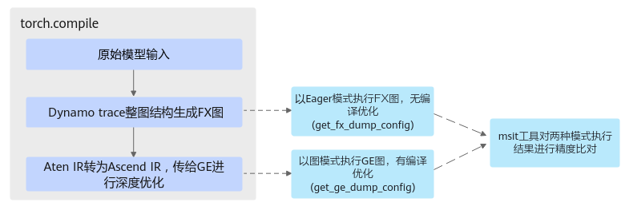

# 精度比对流程

## 简介

当PyTorch网络在昇腾NPU上进行图模式推理时，如果精度不满足预期，应该如何定位和分析问题？

首先进行问题定界，然后将复杂的整网精度问题转换为单个算子问题进行分析。

整体分析流程如下图所示，请根据实际情况逐一排查，目前核心原因集中在：

-   Eager模式下模型存在精度问题。
-   原生Dynamo导致的精度问题。
-   算子成Ascend IR图后导致的精度问题。
-   单个算子运行正常但局部结构成图后导致的精度问题。

**图 1**  精度问题分析流程 


## 精度比对工具

> **说明：** 
>msit工具封装了TorchAir捕获编译过程中图结构和算子数据的相关配置，与[算子输入输出dump功能（图模式）](算子输入输出dump功能（图模式）.md)相比，简化了开发者的参数设置，并在此基础上提供了精度比对等高级功能。

MindStudio（msit工具包）推理工具链为开发者提供了一站式推理开发工具，包括模型压缩、推理数据dump、自动精度比对、性能调优等能力。

精度比对能力一般借助大模型推理精度工具（Large Language Model Debug Tool）实现，其软件包安装参考[msit大模型推理精度工具](https://gitcode.com/Ascend/msit/tree/master/msit/docs/llm)，在“简介\>工具列表”中获取**精度自动比对功能**介绍。

关键命令如下，此处仅为示例，请以开源仓的说明为准，全量参数介绍参见[精度比对命令完整参数](https://gitcode.com/Ascend/msit/blob/master/msit/docs/llm/%E5%B7%A5%E5%85%B7-%E5%A4%A7%E6%A8%A1%E5%9E%8B%E7%B2%BE%E5%BA%A6%E6%AF%94%E5%AF%B9.md#21-%E5%91%BD%E4%BB%A4%E8%A1%8C%E6%96%B9%E5%BC%8F)。

```bash
msit llm compare -gp ${golden_data} -mp ${target_data} -o ${compare_result_dir}
```

**表 1**  关键命令参数


| 参数 | 说明 |
| --- | --- |
| -gp，--golden-path | 指定标杆数据所在路径，支持单个数据文件路径或文件夹。 |
| -mp，--my-path | 指定待比对的数据所在路径，即有精度问题的数据。支持单个数据文件路径或文件夹。 |
| -o，--output | 指定比对结果保存路径。 |

借助msit工具进行图模式与Eager模式下模型精度差异比对的原理如下图所示，具体过程可参考[精度比对案例](精度比对案例.md)。



