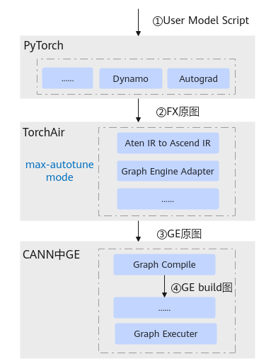

# 编译流程简介

介绍动/静态图概念之前，请参考[简介](简介.md)了解TorchAir架构图，max-autotune模式主要是将PyTorch的FX计算图转换为Ascend IR计算图，并通过（Graph Engine，图引擎）实现图编译和执行。

模型的编译流程如下图所示，脚本执行经过Dynamo编译、TorchAir图优化和GE图编译，最终编译生成GE build图。Dynamo编译后的图称为FX原图，TorchAir优化后的图称为GE原图，GE图编译之后的图称为GE build图。

**图 1**  模型编译流程  

无论是FX图还是GE图，均区分动态图和静态图。本文将深入介绍**Dynamo和GE中的动/静态图概念**，并介绍TorchAir和GE组件的衔接。

此外，本文提供了动、静态图场景下常见的**Tiling调度问题**，以依赖FlashAttention（FA）的算子在GE中下沉调度为例，分析其下沉条件及下沉调度问题的基本定位思路。

