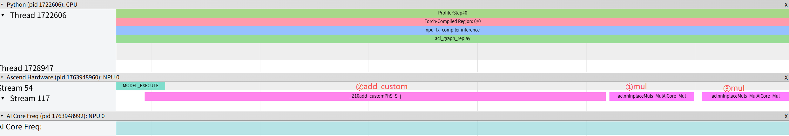

# 自定义算子直调并适配aclgraph

## 概述

本样例展示了如何使用Pybind注册自定义算子，通过<<<>>>内核调用符调用核函数，并适配aclgraph使用该自定义算子，以简单的Add算子和三角函数计算的原地算子为例，实现aclgraph下自定义算子的调用。

## 支持的产品

- Atlas A3 训练系列产品/Atlas A3 推理系列产品
- Atlas A2 训练系列产品/Atlas A2 推理系列产品

## 目录结构介绍

```
├── README.md                   // 示例介绍
├── setup.py                    // setup文件
├── csrc
│   ├── add_custom.asc          // Add算子实现 & 自定义算子注册
│   └── trig_inplace_custom.asc // 原地三角函数算子实现 & 自定义算子注册
├── op_extension
│   ├── __init__.py             // python初始化文件
└── test
    ├── add_aclgraph_test.py    // Add算子aclgraph测试demo
    └── trig_aclgraph_test.py   // 原地三角函数aclgraph测试demo             
```

## 算子描述
### Add算子
- 算子功能：
  Add算子实现了两个数据相加，返回相加结果的功能。对应的算子原型为：
  
  ```
  ascendc_add(Tensor x, Tensor y) -> Tensor
  ```
- 算子规格：
  
  <table>
   <tr><td rowspan="1" align="center">核函数名</td><td colspan="4" align="center">add_custom</td></tr>
  </tr>
  <tr><td rowspan="3" align="center">算子输入</td><td align="center">name</td><td align="center">shape</td><td align="center">data type</td><td align="center">format</td></tr>
  <tr><td align="center">x</td><td align="center">8 * 2048</td><td align="center">int</td><td align="center">ND</td></tr>
  <tr><td align="center">y</td><td align="center">8 * 2048</td><td align="center">int</td><td align="center">ND</td></tr>
  </tr>
  </tr>
  <tr><td rowspan="1" align="center">算子输出</td><td align="center">z</td><td align="center">8 * 2048</td><td align="center">int</td><td align="center">ND</td></tr>
  </tr>
 
  </table>

### 原地三角函数算子
- 算子功能：
  该算子入参为x, out_sin ,out_cos, 算子调用后，out_sin会被原地修改为sin(x)计算结果，out_cos会被原地修改为cos(x)计算结果，返回值tan(x)计算结果。对应的算子原型为：
  
  ```
  ascendc_trig(Tensor x, Tensor(a!) out_sin, Tensor(b!) out_cos) -> Tensor
  ```
- 算子规格：

  <table>
  <tr><td rowspan="1" align="center">核函数名</td><td colspan="4" align="center">trig_inplace_custom</td></tr>
  </tr>
  <tr><td rowspan="4" align="center">算子输入</td><td align="center">name</td><td align="center">shape</td><td align="center">data type</td><td align="center">format</td></tr>
  <tr><td align="center">x</td><td align="center">8 * 2048</td><td align="center">float</td><td align="center">ND</td></tr>
  <tr><td align="center">out_sin</td><td align="center">8 * 2048</td><td align="center">float</td><td align="center">ND</td></tr>
  <tr><td align="center">out_cos</td><td align="center">8 * 2048</td><td align="center">float</td><td align="center">ND</td></tr>
  
  </tr>
  </tr>
  <tr><td rowspan="3" align="center">算子输出</td><td align="center">out_sin</td><td align="center">8 * 2048</td><td align="center">float</td><td align="center">ND</td></tr>
  <tr><td align="center">out_cos</td><td align="center">8 * 2048</td><td align="center">float</td><td align="center">ND</td></tr>
  <tr><td align="center">out_tan</td><td align="center">8 * 2048</td><td align="center">float</td><td align="center">ND</td></tr>
  </tr>
 
  </table>

## 代码实现介绍

- 以Add算子为例，样例在*.asc文件中定义了一个名为ascendc_ops的命名空间，并在其中注册了ascendc_add函数。在ascendc_add函数中通过`c10_npu::getCurrentNPUStream()`函数获取当前NPU上的流，并通过内核调用符<<<>>>调用自定义的Kernel函数add_custom，在NPU上执行算子。
    ```c++
      add_custom<<<blockDim, nullptr, aclStream>>>(xGm, yGm, zGm, totalLength);
    ```
  
- 在pybind11.asc文件中使用了pybind11库来将C++代码封装成Python模块，在Python侧可以通过`import`方式进行调用。例如：
  
  ```c++
  PYBIND11_MODULE(custom_ops, m)
  {
      m.def("run_add_custom", &ascendc_ops::run_add_custom, "");
      m.def("run_trig_custom", &ascendc_ops::run_trig_custom, "");
  }
  ```

- python侧通过`torch.library`将算子逻辑绑定到特定的DispatchKey（PyTorch设备调度标识）。针对NPU设备，需要将算子实现注册到PrivateUse1这一专属的DispatchKey上，例如：
  
  ```python
  ascendc_ops = library.Library("ascendc_ops", "DEF")

  ascendc_ops.define("ascendc_add(Tensor a, Tensor b) -> Tensor")

  @library.impl(ascendc_ops, "ascendc_add", "PrivateUse1")
  def add_custom_ops(a, b):
      return custom_ops.run_add_custom(a, b) 
  ```

- 注册Meta函数：
  注册Meta函数使faketensor流程正常工作，在使用fx, compile等功能涉及，本示例在add_aclgraph_test.py开头注册代码如下：

  ```python
  @library.impl(ascendc_ops, "ascendc_add", "Meta")
  def ascendc_add_meta(a, b):
      return torch.empty_like(a)
  ```

- aclgraph的调用：
  [示例代码](./test/add_aclgraph_test.py)中，展示了3种aclgraph的使能方式，通过对比NPU输出与CPU标准加法结果来验证自定义算子的数值正确性。

1. torch.npu.NPUGraph()
2. torch.npu.make_graphed_callables
3. backend="npugraph_ex"

## 编译运行

在本样例根目录下执行如下步骤，编译并执行算子。

- 环境安装
  
1. 请参考与您当前使用的版本配套的[《Ascend Extension for PyTorch
   软件安装指南》](https://www.hiascend.com/document/detail/zh/Pytorch/720/configandinstg/instg/insg_0001.html)，获取PyTorch和torch_npu详细的安装步骤。
   
   本样例需torch2.6.0及以上版本，支持`backend="npugraph_ex"`需7.3.0及以上版本。
2. 根据实际环境安装CANN toolkit包，本样例需8.5.0及以上版本，安装指导详见《[CANN 软件安装指南](https://www.hiascend.com/document/redirect/CannCommunityInstSoftware)》。
3. 根据实际环境安装CANN ops包。根据产品型号和环境架构，下载对应安装包，可参考[下载链接](https://ascend.devcloud.huaweicloud.com/cann/run/software/8.5.0-beta.1)并执行如下命令安装：
   
   ```bash
   # 确保安装包具有可执行权限
   chmod +x Ascend-cann-${soc_name}-ops_${cann_version}_linux-${arch}.run
   # 安装命令
   ./Ascend-cann-${soc_name}-ops_${cann_version}_linux-${arch}.run  --install --quiet --install-path=${install_path}
   ```
   
   - \$\{soc\_name\}：表示NPU型号名称，即\$\{soc\_version\}删除“ascend”后剩余的内容。
   - \$\{install\_path\}：表示指定安装路径，需要与toolkit包安装在相同路径，默认安装在`/usr/local/Ascend`目录。

- 配置环境变量
  
  请根据当前环境上CANN开发套件包的安装位置，执行如下配置环境变量的命令。
  
    ```bash
    source ${install_path}/ascend-toolkit/set_env.sh
    ```


- 样例执行

  参考[表格](https://www.hiascend.com/document/detail/zh/canncommercial/850/opdevg/BishengCompiler/atlas_bisheng_10_0010.html)，根据实际昇腾AI处理器架构修改[setup.py](./setup.py)中的--npu-arch参数，并执行如下命令：
  
  ```bash
  python setup.py bdist_wheel
  pip install dist/*.whl --force-reinstall
  cd test
  python ./add_aclgraph_test.py
  ```

执行结果如下，说明精度对比成功。

```bash
Ran * test in **s.
OK
```

### 注意事项

NPU的taskqueue是设备端的任务队列，用于管理和调度NPU上的算子执行顺序。"清queue"指等待队列中已有任务完成后再执行当前任务；"入queue"指将当前任务放入队列中按顺序执行。自定义算子的内核启动方式如果采用[add_custom.asc](./csrc/add_custom.asc) 中的**方式4**（stream(false)直接启动，不清queue不入queue），可能导致乱序执行。

例如以下Model：
```python
class Model(torch.nn.Module):
    def forward(self, x, y):
        x *= 2 # mul_1
        x = torch.ops.ascendc_ops.ascendc_add(x, y) # add_custom
        x *= 2 # mul_2
        return x
```
通过profiler工具采集部分结果如下图：

可见图中add_custom和第一个mul运算发生乱序。

**建议**：具体其他实现方式请参考 [add_custom.asc](./csrc/add_custom.asc) 中的注释说明。


