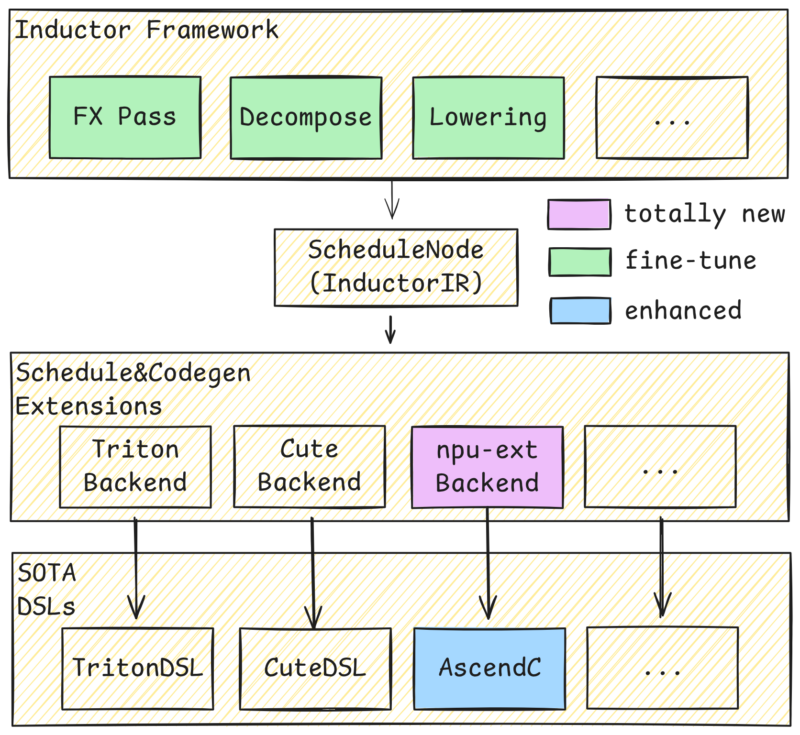

## 介绍

inductor-npu-ext 正在为 NPU 设备添加一个新的 Inductor 后端，该后端定位于使用 NPU 上的 SOTA DSL 生成 Inductor 融合 Kernel。

inductor-npu-ext 当前基于 AscendC 生成融合Kernel。



当前的主要工作：

* [X] 支持 Pointwise/Reduction 融合
* [ ] 支持水平融合与垂直融合
* [X] 支持动态 Shape
* [ ] 支持MM尾声&序幕融合
* [ ] SuperKernel融合(一种降低 Device 上 Kernel 调度间隙的技术)
* [X] 支持需要 Workspace 内存的 Kernel
* [ ] PGO（Profiling Guide Optimize）性能寻优
* [X] 基于硬件性能建模的模板&Tiling寻优

---

## 软件安装

### 安装torch_npu

> inductor-npu-ext 依赖 torch 2.8+ 版本

```bash
pip3 install torch_npu==2.8 # 通过pip安装torch_npu时会自动安装依赖的torch版本
pip3 install numpy # torch依赖numpy
```

### 安装CANN-8.5.0

- [CANN快速安装指南（不含驱动和固件）](https://www.hiascend.com/document/detail/zh/CANNCommunityEdition/850/quickstart/instg_quick.html) -- 推荐离线安装方式
- [CANN安装指南（含驱动和固件）](https://www.hiascend.com/document/detail/zh/CANNCommunityEdition/850/softwareinst/instg/instg_0000.html?Mode=PmIns&InstallType=netconda&OS=openEuler)
- [CANN与torch_npu配套关系说明](https://gitcode.com/Ascend/pytorch#%E6%98%87%E8%85%BE%E8%BE%85%E5%8A%A9%E8%BD%AF%E4%BB%B6)

### 安装inductor-npu-ext

> inductor-npu-ext仍处于实验阶段，代码位置可能变动。

```bash
git clone git@gitcode.com:Ascend/torchair.git
cd torchair/experimental/_inductor_npu_ext/
pip3 install -e .
```

---

## 功能验证

执行前，需要执行 CANN 安装目录下的 set_env.sh 设置 CANN 相关环境变量

> 例如CANN安装路径为 `/usr/local/Ascend/cann`，则执行：

```bash
source /usr/local/Ascend/cann/set_env.sh
```

运行以下代码进行功能验证：

```python
import torch
import inductor_npu_ext

@torch.compile
def test_add_sum(x, y):
    return torch.add(x, y).sum()

x = torch.randn(32, 1024).npu()
y = torch.randn(1, 1024).npu()

out = test_add_sum(x, y)
golden = (x + y).sum()

max_diff = torch.max(torch.abs(out - golden))
assert max_diff < 1e-3, max_diff
print("Succeed")
```
