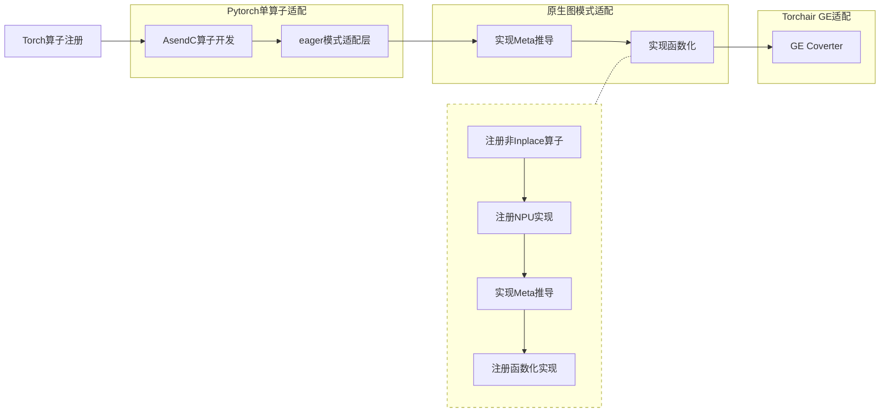
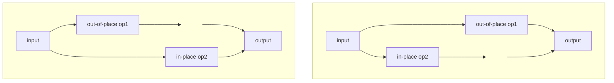
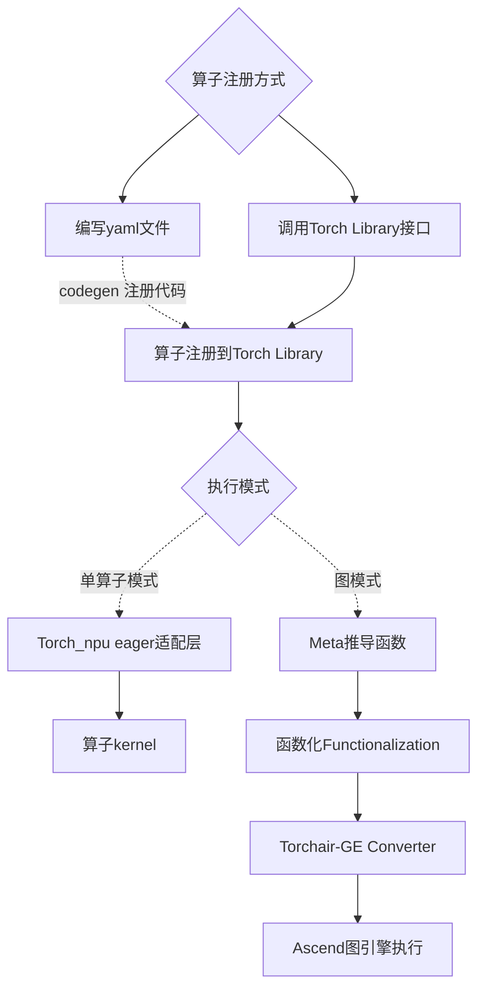

# 原地操作算子入图指导

## 前言

### 背景

Torch在低版本（以torch2.1示例）中，对于原地操作（Inplace）算子直接入图会报错，提示需要针对该算子做函数化（Functionalization）的适配工作。您可能对图中的“函数化”一词感到陌生，了解函数化前，需要先了解Inplace与非Inplace：计算时会修改输入的算子称为Inplace算子（或原地算子、Ref类算子等），例如torch.ops.aten.add\_。与torch.ops.aten.add\_对应的非Inplace算子为torch.ops.aten.add，其结果写入输出而非直接修改输入。
函数化转换，可以简单理解为将Inplace算子替换为非Inplace算子的过程，例如将torch.ops.aten.add\_替换为torch.ops.aten.add。Torch图模式基于函数化后的图（FX图）工作，因此Inplace类算子与Torch图模式配合工作时，需要实现函数化转换，实现将图上的Inplace算子替换为非Inplace算子

### 示例目标

在Torch上实现一个原地操作(Inplace)算子，并通过实现函数化（Functionalization），使其在Eager和图模式下正常工作。定义Inplace类Torch算子时需要遵循以下约定：

* Tensor类型输入在前，基本类型输入在后
* 不要返回任何被Inplace修改的输入
  
  *为什么要遵循这个约定：Torch2.5+支持自动完成函数化转换，该特性要求不返回被修改的输入，Torchair将在后续版本支持该特性。示例基于Torch2.1版本开发，需要您手动实现函数化(Functionalization)转换。*

Inplace算子原型定义如下：

```yaml
func: my_inplace(Tensor(a!) x,  Tensor(b!) y) -> ()
```

my\_inplace的原型Schema含义如下：

my\_inplace：为算子名，对应调用方式为torch.ops.npu.my\_inplace

Tensor(a!) x：表示x为Tensor类型输入，(a!)表示该输入具有别名a且会被修改。

Tensor(b!) y：表示y为Tensor类型输入，(b!)表示该输入具有别名b且会被修改。

-> ()：表示算子无返回值，对应Python中的None。

### 流程图

遵循示例中的最佳实践，您需要完成如下步骤：



## 适配指导

本指导将以原地操作算子my_inplace_op为例，说明该如何在torch_npu进行适配开发，my_inplace_op定义如下：

```yaml
- func: my_inplace(Tensor(a!) x, Tensor(b!) y) -> ()
```

### 一、实现原地操作（Inplace）算子

#### 1.Ascend C自定义算子开发

##### 1.1 原型定义与自定义算子工程创建

AscendC算子定义时，名称为torch算子名的大驼峰格式，同时入参顺序与类型应当与Torch算子完全一致。算子工程依赖原型定义json用于工程生成，创建def.json并写入以下内容，需要特别注意的是，AscendC算子定义时，​**被修改的输入必须定义一个同名输出**​，表达算子执行时对该输入的修改。

```json
[{
"op":"MyInplace",
"input_desc":[
{"name":"x","param_type":"required","format":["ND"],"type":["float"]},{"name":"y","param_type":"required","format":["ND"],"type":["float"]}
],
"output_desc":[
{"name":"x","param_type":"required","format":["ND"],"type":["float"]},{"name":"y","param_type":"required","format":["ND"],"type":["float"]}
]
}]
```

使用msopgen生成自定义算子工程

```bash
# 命令行中的-c ai_core-ascend910B1，需要与实际环境保持一致
msopgen gen -i def.json -c ai_core-ascend910B1 -f pytorch -lan cpp -out ./MyInplace
```

生成的核心目录结构如下

```bash
├── build.sh # 算子包编译脚本
├── op_host
│   ├── my_inplace.cpp # Tiling/InferShape/InferDataType实现
│   └── my_inplace_tiling.h
└── op_kernel
    └── my_inplace.cpp # Kernel实现
```

##### 1.2 实现Kernel与Tiling

示例直接使用默认生成的Kernel和Tiling空实现，不影响编译与执行

##### 1.3 实现InferShape与InferDataType

**当您需要使用Torchair-GE图模式时，必须要实现InferShape与InferDataDtype。**

自定义算子工程会在op\_host/my\_inplace.cpp中生成一份简单但通常合适的默认实现。默认实现假设输出的shape和type与第一个输入完全相同。由于MyInplace算子有两个输出，因此不能使用默认实现，修改op\_host/my\_inplace.cpp种的InferShape/InferDataType实现如下

```cpp
static ge::graphStatus InferShape(gert::InferShapeContext* context)
{
    *context->GetOutputShape(0) = *ontext->GetInputShape(0); // 输出0与输入0相同
    *context->GetOutputShape(1) = *ontext->GetInputShape(1); // 输出1与输入1相同
    return GRAPH_SUCCESS;
}

static ge::graphStatus InferDataType(gert::InferDataTypeContext *context)
{
    context->SetOutputDataType(0, context->GetInputDataType(0)); // 输出0与输入0相同
    context->SetOutputDataType(1, context->GetInputDataType(1)); // 输出1与输入1相同
    return ge::GRAPH_SUCCESS;
}
```

##### 1.4 自定义算子包编译与安装

注意，自定义算子包的默认vendor名为customize，相同vendor名称的算子包会互相覆盖

```bash
cd ./MyInplace
bash build.sh
bash build_out/custom*.run
cd ..
```

##### 1.5 适配Pytorch Eager模式调用

完成Torch算子注册与其对应的NPU实现（AscendC算子）后，需要在Torch算子的Eager适配层调用AscendC算子
使用Op-plugin提供的工程化适配能力，简化Eager模式适配层开发，在op-plugin中注册如下my_inplace算子，追加gen\_opapi字段，exec: aclnnMyInplace中aclnn为固定前缀，MyInplace为AscendC算子名，表示调用AscendC算子MyInplace实现Torch算子my\_inplace

```yaml
-- third_party/op_plugin/op_plugin/config/op_plugin_functions.yaml添加如下代码：

- func: my_inplace(Tensor(a!) x, Tensor(b!) y) -> ()
    op_api: all_version
    gen_opapi:
      exec: aclnnMyInplace # 自动生成实现代码：等价于调用AscendC算子MyInplace，且入参为x、y
```

#### 2.实现Meta推导函数

Torch原生要求所有能与torch.compile配合工作的Torch算子实现Meta推导函数，Meta推导函数表达Torch算子输出与输入shape、dtype以及内存的关系，即算子在调用后输出的shape、dtype可根据算子的入参来推导

```python
-- third_party/op_plugin/op_plugin/python/meta/_meta_registrations.py中添加如下代码

# 通常以Torch算子名+"_meta"后缀命名Meta推导函数
# m为npu算子的Meta实现库，定义在文件开头m = Library("npu", "IMPL", "Meta")
@impl(m, "my_inplace", "Meta")
def my_inplace_meta(x, y):
    pass # my_inplace原地算子没有返回值，直接pass即可
```

### 二、实现函数化（Functionalization）

前面的章节已经介绍，函数化可以简单理解为将FX图上的Inplace算子替换为非Inplace算子，因此需要为Inplace算子torch.ops.npu.my\_inplace注册对应的非Inplace算子用于替换，同时完成非Inplace算子的Eager模式实现、Meta推导函数，以及Inplace算子到非Inplace算子的转换函数

#### 1.定义非原地算子

```yaml
-- third_party/op_plugin/op_plugin/config/op_plugin_functions.yaml添加如下代码：

# 非原地操作算子
- func: my_inplace_functional(Tensor x, Tensor y) -> (Tensor, Tensor)
  op_api: all_version
```

非原地算子名为原地算子名+“_functional”后缀，且因为不是直接修改输入，所以需要添加输出

#### 2.非原地算子适配实现

my\_inplace\_functional的NPU实现正常执行时不会调用，但在图模式精度调试时非常重要，因此建议实现

```cpp
-- 创建op_plugin/ops/opapi/{Your_op_name}KernelNpuOpApi.cpp

#include "op_plugin/OpApiInterface.h"
#include "op_plugin/utils/op_api_common.h"

namespace op_api {
std::tuple<at::Tensor, at::Tensor> my_inplace_functional(
    const at::Tensor &x,
    const at::Tensor &y)
{
    auto x_clone = x.clone(); // 非原地算子不能直接修改入参，所以这里要先拷贝入参
    auto y_clone = y.clone();
    EXEC_NPU_CMD(aclnnMyInplace, x_clone, y_clone);  // 调用原地算子的aclnn接口
    return std::make_tuple(x_clone, y_clone);
}

} // namespace op_api
```

#### 3.实现Meta函数推导

```
-- -- third_party/op_plugin/op_plugin/python/meta/_meta_registrations.py中添加如下代码

# 注册非原地操作算子meta实现，用于torch FX图的shape、dtype推导，即算子在调用后输出的shape、dtype可根据算子的入参来推导
@impl(m, "my_inplace_functional", "Meta")
def my_inplace_functional_meta(x, y):
    return torch.empty_like(x), torch.empty_like(y)
```

#### 4.实现原地算子的Functionalization

```cpp
-- "在opplugin仓库的算子适配层op_plugin/ops/opapi 下创建RegisterFunctionalization_npu_ops.cpp，
     并参考以下内容实现自己算子的functionalization 函数"
#include <ATen/core/LegacyTypeDispatch.h>
#include <ATen/EmptyTensor.h>
#include <ATen/FunctionalTensorWrapper.h>
#include <ATen/MemoryOverlap.h>
#include <torch/library.h>
#include "torch_npu/csrc/core/npu/npu_log.h"
#include <c10/util/Logging.h>

#include <ATen/Operators.h>
#include <ATen/NativeFunctions.h>
#include "torch_npu/csrc/aten/CustomFunctions.h"
#include "torch_npu/csrc/core/npu/NPUException.h"

namespace at_npu {
namespace functionalization {
void my_inplace_functional_npu(c10::DispatchKeySet dispatchKeySet, at::Tensor& x, at::Tensor& y) {

    // 1.对所有入参中的tensor调用sync()
    at::functionalization::impl::sync(x);
    at::functionalization::impl::sync(y);
    // 2.调用_from_functional_tensor解包所有需要调用非原地算子的入参    
    auto x_unwarp = at::functionalization::impl::from_functional_tensor(x);
    auto y_unwarp = at::functionalization::impl::from_functional_tensor(y);

    // Redispath to the out-of-place op when mutable op is called by user
    at::Tensor tmp_input1;
    at::Tensor tmp_input2;
    {
        at::AutoDispatchSkipFunctionalize guard;
        // 3.调用非原地算子，得到临时输出
        auto tmp_result = at_npu::native::custom_ops::my_inplace_functional(x_unwarp , y_unwarp);        
        tmp_input1 = std::get<0>(tmp_result);
        tmp_input2 = std::get<1>(tmp_result);
    }
    // 4.将临时输出拷贝给输入，达到原地修改的目的
    at::functionalization::impl::replace_(x, tmp_input1);
    at::functionalization::impl::replace_(y, tmp_input2);
    at::functionalization::impl::commit_update(x);
    at::functionalization::impl::commit_update(y);
    // 5.再次调用sync()
    at::functionalization::impl::sync(x);
    at::functionalization::impl::sync(y);
}
} // namespace functionalization

namespace {
// 注册Functionalize
TORCH_LIBRARY_IMPL(npu, Functionalize, m) {
    m.impl("my_inplace", TORCH_FN(functionalization::my_inplace_functional_npu));
}
}  // namespace

} // namespace at_npu
```

#### 5.实现非原地算子的Converter

实现原地算子的functionalization并入图后，原地算子将被替换成非原地算子，所以要对非原地算子做converter，再将其转换为原地算子的Ascend IR
实现Converter就是使用Ascend IR表算子计算逻辑，在Eager模式下my\_inplace\_functional对输入拷贝后调用AscendC算子MyInplace，对应Converter实现，则为先调用Ascend IR TensorMove对输入进行拷贝，再调用Ascend IR MyInplace

*（在AscendC算子工程编译时，除了生成aclnn接口外，还会同步生成同名Ascend IR的注册代码）*

```python
-- 在torch_npu的third_party/torchair/torchair/python/torchair/_ge_concrete_graph/ge_converter/custom下创建{your_op_name}.py

from torchair._ge_concrete_graph.fx2ge_converter import register_fx_node_ge_converter
from torchair.ge import Tensor
from typing import Any
from torchair._ge_concrete_graph import ge_apis as ge

# 实现非原地算子的converter
@register_fx_node_ge_converter(torch.ops.npu.my_inplace_functional.default)
def conveter_my_inplace_functional(
        x: Tensor,
        y: Tensor,
        meta_outputs: Any = None):
    x_copy = ge.TensorMove(x) # 非原地算子不能直接修改入参，所以这里要先拷贝入参
    y_copy = ge.TensorMove(y)
    return torchair.ge.custom_op(  # 根据算子定义设置变量名，顺序保持一致
        "MyInplace", # 使用原地算子的Ascend IR
        inputs={
            "x": x_copy,
            "y": y_copy,
        },
        outputs=['x', 'y'] # 返回被原地修改的入参
    )
```

#### 6.验证脚本

完成以上代码后，编译torch_npu包并安装，执行图模式验证原地算子成功入图且入参被原地修改
<br />
<br />

---

<br />

## 适配指导（插件化注册）

如果您不希望在op-plugin开发及编译，可以选择插件化方式完成适配

本章节将仍以原地操作算子my_inplace_op为例，说明该如何在进行插件化适配开发：

```yaml
- func: my_inplace(Tensor(a!) x, Tensor(b!) y) -> ()
  op_api: all_version
  gen_opapi:
    exec: aclnnMyInplace # 自动生成实现代码：调用AscendC算子MyInplace
```

**插件化方式适配为纯python代码，您可以在py文件中实现以下步骤中的代码，并在模型执行前加载即可**

### 1.注册原地算子的非原地版本

```python
import torch
import torch_npu
from torch.library import Library, impl

# 根据命名空间获取原地算子注册的Library，如您的算子通过op-plugin注册，则其命名空间为npu，否则使用您注册算子时的命名空间
# （您通过torch.ops.xxx.{your_op_name}调用算子时的xxx就是该算子的命名空间）
m = Library("npu", "FRAGMENT")

# 定义原地算子的非原地版本，参数列表与原地算子相同，并去除表示原地修改含义的a!、b!，添加返回值
m.define("my_inplace_functional(Tensor x, Tensor y) -> (Tensor, Tensor)")

# 注册非原地算子的实现。NPU通过PrivateUse1设备扩展接入Torch，因此此处实现选择的Dispatch key为PrivateUse1
@impl(m, "my_inplace_functional", "PrivateUse1")
def my_inplace_functional_npu(x, y):
    x_clone = x.clone()
    y_clone = y.clone()
    torch.ops.npu.my_inplace(x_clone, y_clone)
    return x_clone, y_clone

# 注册非原地操作算子meta实现，用于torch FX图的shape、dtype推导，即算子在调用后输出的shape、dtype可根据算子的入参来推导
@impl(m, "my_inplace_functional", "Meta")
def my_inplace_functional_meta(x, y):
    return torch.empty_like(x), torch.empty_like(y)

# 注册原地操作算子meta实现，若您已经注册过，该步骤可忽略。
@impl(m, "my_inplace", "Meta")
def my_inplace_meta(x, y):
    pass # 原地算子没有返回值，直接pass即可
```

### 2.实现原地算子的functionalization

将原地算子替换成调用非原地版本得到临时输出，并将临时输出拷贝给入参，达到去除input mutations并和原函数保持语义一致的目的

```python
@impl(m, "my_inplace", "Functionalize")
def custom_add_func(x, y):
    x_out, y_out = torch.ops.npu.my_inplace_functional(x, y)
    x.copy_(x_out)
    y.copy_(y_out)
```

### 3.实现非原地算子的converter

第2步实现functionalization后，原地算子将被替换成非原地算子，所以要对非原地算子做converter，再将其转换为原地算子的Ascend IR

```python
from torchair import register_fx_node_ge_converter
from torchair.ge import Tensor
from typing import Any
from torchair._ge_concrete_graph import ge_apis as ge

# 实现非原地算子的converter
@register_fx_node_ge_converter(torch.ops.npu.my_inplace_functional.default)
def conveter_my_inplace_functional(
        x: Tensor,
        y: Tensor,
        meta_outputs: Any = None):
    x_copy = ge.TensorMove(x) # 非原地算子不能直接修改入参，所以这里要先拷贝入参
    y_copy = ge.TensorMove(y)
    torchair.ge.custom_op(  # 根据算子定义设置变量名，顺序保持一致
        "MyInplace", # 使用原地算子的Ascend IR
        inputs={
            "x": x_copy,
            "y": y_copy,
        },
        outputs=['x', 'y'] # 返回被原地修改的入参
    )
```

### 4.验证脚本

在执行模型前加载上述代码，执行图模式验证原地算子成功入图且入参被原地修改
<br />
<br />

---

<br />

## 附录

本文中提到的一些适配工作的相关资料可以参考下表

| 工作项      | 说明 |指导|
| ----------- | ----------- |----------- |
| 原地操作算子实现      | 使用Ascend C开发一套原地操作算子的实现|[Ascend C算子实现](https://www.hiascend.com/document/detail/zh/canncommercial/800/developmentguide/opdevg/Ascendcopdevg/atlas_ascendc_10_0031.html) |
| op-plugin注册算子   | 在op-plugin注册算子并实现适配层代码|[适配开发](https://www.hiascend.com/document/detail/zh/Pytorch/700/modthirdparty/modparts/thirdpart_0014.html)|
| GE图适配   | 完成InferShape、InferDtype等代码交付件，使得算子能在GE图模式上编译与运行|[算子入图（GE）图开发](https://www.hiascend.com/document/detail/zh/canncommercial/800/developmentguide/opdevg/Ascendcopdevg/atlas_ascendc_10_0077.html)|
| torchair适配   | 算子converter注册和实现，使得算子在FX图上的节点能转换为GE图节点|[算子converter注册和实现](https://www.hiascend.com/document/detail/zh/Pytorch/700/modthirdparty/torchairuseguide/torchair_0046.html)|

<br />
<br />

---

<br />

## FAQ

#### 原地算子注册常见问题

* 常见错误写法：
  定义算子时是非原地算子，meta函数也是按照非原地去实现的，但是算子适配层和converter却是将输入作为输出返回出去。这就出现了算子本身的多个行为不一致。
  
  如：定义了一个非原地算子func，入参是A,B，返回值是C,D，即：
  C,D = FUNC(A,B)
* 此时会出现两种问题：
  1、此时预期C,D 和A,B 完全无关，但是当后续原地修改C,D时会导致A,B 也被隐式修改。
  2、A,B丢给func作为入参使用之后，A,B的值也被隐式修改了
  以上都是调用func的人，预期之外的问题。

#### 为什么要实现Functionalization

原生torch行为，在低版本（torch2.1）中，具有原地操作行为的算子，无法直接入图，会报错提示该算子需要实现functionalization，社区给出的functionalization实现逻辑为：先调用算子的非原地版本得到临时输出，然后将临时输出拷贝到输入上

#### 如果不实现Functionalization，会有什么问题

假设用户在定义算子时，没有表示为一个原地操作算子，欺骗了编译器而入图，可能因为执行顺序的问题造成隐形的精度问题，如下给出一个示例：
如图所示，假设input会被out-of-place op1读且会被in-place op2修改，则示例中左右两种执行顺序不同，执行的结果也截然不同



#### 算子调用路径是什么样的

下图简单呈现上述适配工作的几个部分处于算子调用路径的什么位置


